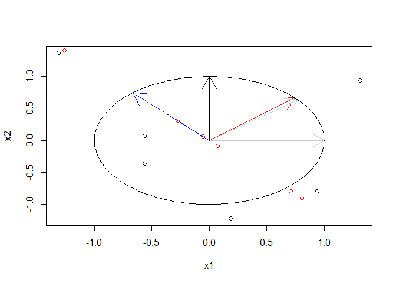
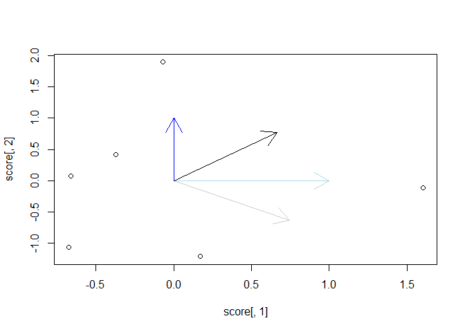

PLS
================
Lemariey
2023-07-11

``` r
#laod packages
library(pls)
```

    ## Warning: le package 'pls' a été compilé avec la version R 4.2.3

    ## 
    ## Attachement du package : 'pls'

    ## L'objet suivant est masqué depuis 'package:stats':
    ## 
    ##     loadings

``` r
library(plsRglm)
```

    ## Warning: le package 'plsRglm' a été compilé avec la version R 4.2.3

``` r
library(matlib)
```

    ## Warning: le package 'matlib' a été compilé avec la version R 4.2.3

``` r
# Define the data
x1 <- c(1, 3, 8,7,3,5)
x2 <- c(6, 2, 5,1,3,0)

x1 <- (x1-mean(x1))/sd(x1)
x2 <- (x2- mean(x2))/sd(x2)
y <- c(3, 4, 5,6,0,-2)

# Combine the data into a data frame
data <- data.frame(x1, x2, y)
```

``` r
# Fit the pls model
model <- plsr(y ~ x1 + x2, data=data, ncomp = 2)
model2 <- plsR(y ~ x1 + x2, data=data, ncomp = 2)
```

    ## ____************************************************____
    ## ____Component____ 1 ____
    ## ____Component____ 2 ____
    ## ____Predicting X without NA neither in X nor in Y____

    ## Le chargement a nécessité le package : plsdof

    ## ****________________________________________________****

``` r
# Print the model summary
summary(model)
```

    ## Data:    X dimension: 6 2 
    ##  Y dimension: 6 1
    ## Fit method: kernelpls
    ## Number of components considered: 2
    ## TRAINING: % variance explained
    ##    1 comps  2 comps
    ## X    36.38   100.00
    ## y    33.19    33.22

``` r
model$coefficients
```

    ## , , 1 comps
    ## 
    ##           y
    ## x1 1.550165
    ## x2 1.386789
    ## 
    ## , , 2 comps
    ## 
    ##           y
    ## x1 1.518439
    ## x2 1.425402

``` r
model2$Coeffs
```

    ##               [,1]
    ## Intercept 2.666667
    ## x1        1.518439
    ## x2        1.425402

``` r
#base 1 c'est la base des x
model$loadings#c'est les coefficients de regression entre les x1 et les t1 dans l'espace des observations de dimension n
```

    ## 
    ## Loadings:
    ##    Comp 1 Comp 2
    ## x1  0.773 -0.667
    ## x2  0.635  0.745
    ## 
    ##                Comp 1 Comp 2
    ## SS loadings     1.002  1.000
    ## Proportion Var  0.501  0.500
    ## Cumulative Var  0.501  1.001

``` r
model2$pp
```

    ##       Comp_1     Comp_2
    ## x1 0.7733301 -0.6667412
    ## x2 0.6353969  0.7452893

``` r
#weights
base2 <- model$loading.weights#coordonnées des x dans la base 2 cette base est orthogonal. inverse= transposee
model2$wwnorm#coordonnée base 2
```

    ##       Comp_1     Comp_2
    ## x1 0.7452893 -0.6667412
    ## x2 0.6667412  0.7452893

``` r
#la base 3 c'est le w* de simca: c'est une matrice de changeemnt de base tq T=XW*. Cette matrice n'est pas orthogonale.
wstar <- model2$wwetoile#ok
```

``` r
#scores
score <- model$scores##coordonnées des obs dans la base 3
model2$tt#score ok
```

    ##        Comp_1      Comp_2
    ## 1 -0.06756089  1.89170809
    ## 2 -0.65939432  0.07950683
    ## 3  1.60254439 -0.11133368
    ## 4  0.17160467 -1.20815426
    ## 5 -0.37158491  0.41332704
    ## 6 -0.67560893 -1.06505402

``` r
#loadings Y
model$Yloadings
```

    ## 
    ## Loadings:
    ##   Comp 1 Comp 2
    ## y 2.08         
    ## 
    ##                Comp 1 Comp 2
    ## SS loadings     4.326  0.002
    ## Proportion Var  4.326  0.002
    ## Cumulative Var  4.326  4.329

``` r
#propriétes sur les composantes
t1 <- score[,1]
t2 <- score[,2]
cor(t1,t2)
```

    ## [1] -3.923671e-17

``` r
dt1 <- sqrt(sum(t1*t1))
dt2 <- sqrt(sum(t2*t2))
ps <- sum(t1*t2)/(dt1*dt2)
#les composantes sont orthogonal dans l'espace a n dimension et leur covariane est nulle.
```

``` r
#base 2
m <- matrix(base2,ncol=2)#base 2 est orthogonal donc l'inverse=transposée
inv_base2 <- t(m)#coordonnées des composantes dans la base 1
inv(m)
```

    ##            [,1]      [,2]
    ## [1,]  0.7452893 0.6667412
    ## [2,] -0.6667412 0.7452893

``` r
#base 3
inv_wstar <- inv(wstar)#


#verification th=X*w*
data_m <- as.matrix(data[,-3])
data_m%*%wstar
```

    ##      Coord_Comp_1 Coord_Comp_2
    ## [1,]  -0.06756089   1.89170809
    ## [2,]  -0.65939432   0.07950683
    ## [3,]   1.60254439  -0.11133368
    ## [4,]   0.17160467  -1.20815426
    ## [5,]  -0.37158491   0.41332704
    ## [6,]  -0.67560893  -1.06505402

``` r
(t1 <- model2$tt[,1])
```

    ##           1           2           3           4           5           6 
    ## -0.06756089 -0.65939432  1.60254439  0.17160467 -0.37158491 -0.67560893

``` r
#Deflation
norme <- as.vector((t1%*%t1))
projection <- matrix(t1)%*%t(matrix(t1))/norme
xdeflated <- data_m-projection%*%data_m


#on verifie que Th=Xdeflatedh*compo_h de la base 2
(t2_deflated <- xdeflated%*%base2[,2])#on regarde comment xdelated se projete sur la 2eme composante 
```

    ##             [,1]
    ## [1,]  1.89170809
    ## [2,]  0.07950683
    ## [3,] -0.11133368
    ## [4,] -1.20815426
    ## [5,]  0.41332704
    ## [6,] -1.06505402

``` r
t2
```

    ##           1           2           3           4           5           6 
    ##  1.89170809  0.07950683 -0.11133368 -1.20815426  0.41332704 -1.06505402

GRAPH

``` r
#dans la base d'origine
plot(x1,x2)#données avant delfation
points(xdeflated[,1],xdeflated[,2],col="red")#données après delfation
arrows(0,0,1,0,col="grey80")#abse1
arrows(0,0,0,1,col="black")#base1
arrows(0,0,inv(model2$wwnorm)[1,1],inv(model2$wwnorm)[1,2],col="red")
arrows(0,0,inv(model2$wwnorm)[2,1],inv(model2$wwnorm)[2,2],col="red")
arrows(0,0,inv_wstar[1,1],inv_wstar[1,2],col="lightblue")
arrows(0,0,inv_wstar[2,1],inv_wstar[2,2],col="blue")
# prepare "circle data"
radius = 1
center_x = 0
center_y = 0
theta = seq(0, 2 * pi, length = 200) # angles for drawing points around the circle
# draw the circle
lines(x = radius * cos(theta) + center_x, y = radius * sin(theta) + center_y)
```

<!-- -->

``` r
#EN UTILISANT LE THEOREME DE THALES? ON RETORUVE BIEN QUE LES COORDONN2ES DE x1 SUR C1 ET COORDON2ES DE X2 SUR c1 SONT LES MEMES QUELQUE SOIT LA BASE 5 ABSE 2 OU BASE 3°


#dans la base 3
plot(score[,1],score[,2])#données avant delfation
arrows(0,0,1,0,col="lightblue")#base3
arrows(0,0,0,1,col="blue")#base3
arrows(0,0,wstar[1,1],wstar[1,2],col="grey80")
arrows(0,0,wstar[2,1],wstar[2,2],col="black")
```

<!-- -->

``` r
#biplot

#pour les variables, corrélations dans l'espace des observations à n dimension.
cor(x1,t1)
```

    ## [1] 0.6590556

``` r
cor(x1,t2)
```

    ## [1] -0.7520942

``` r
#pour les scores, ils sont ramené dans le cercle de rayon 1 en divisant tous les scores par la plus grande valeur absolue.
```
