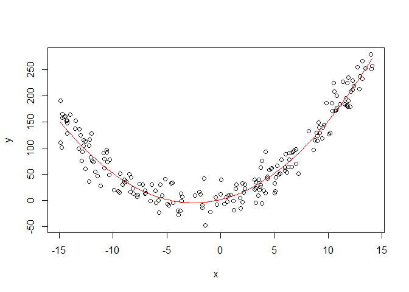
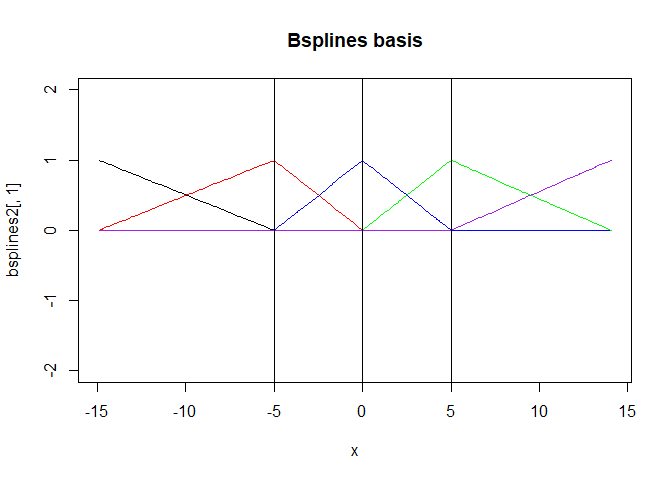
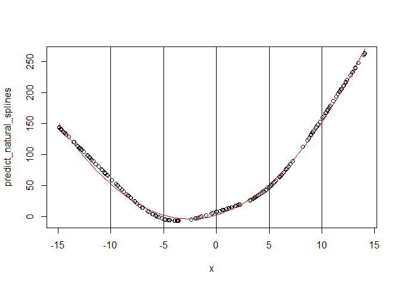
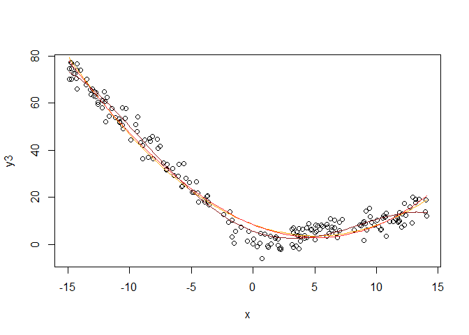
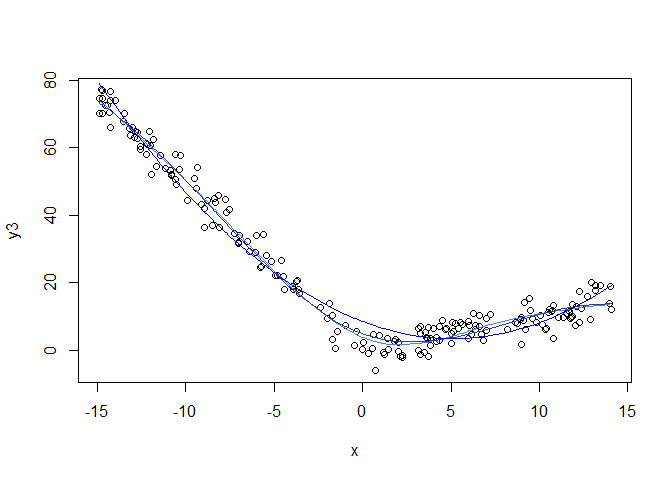
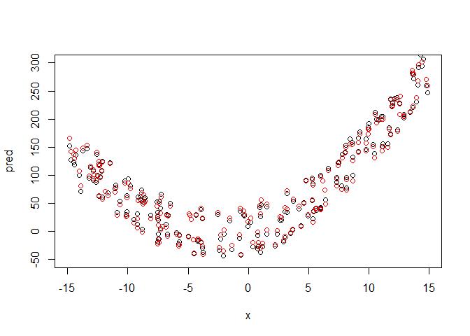
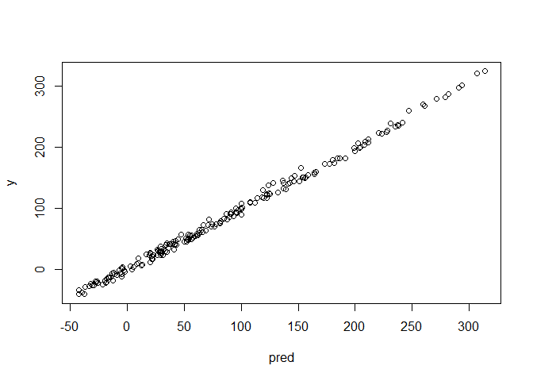
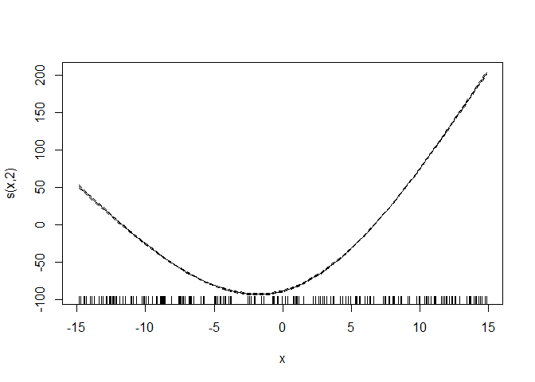

Splines and GAM
================
Lemariey
2023-06-08

``` r
library(gam)
```

    ## Warning: le package 'gam' a été compilé avec la version R 4.2.3

    ## Le chargement a nécessité le package : splines

    ## Le chargement a nécessité le package : foreach

    ## Warning: le package 'foreach' a été compilé avec la version R 4.2.3

    ## Loaded gam 1.22-2

``` r
library(splines)
library(mgcv)
```

    ## Warning: le package 'mgcv' a été compilé avec la version R 4.2.3

    ## Le chargement a nécessité le package : nlme

    ## This is mgcv 1.8-42. For overview type 'help("mgcv-package")'.

    ## 
    ## Attachement du package : 'mgcv'

    ## Les objets suivants sont masqués depuis 'package:gam':
    ## 
    ##     gam, gam.control, gam.fit, s

``` r
library(schoenberg)
```

    ## Warning: le package 'schoenberg' a été compilé avec la version R 4.2.3

    ## -----------------------------------------------------  schoenberg version 2.0.2  --

    ## Please report any bugs or feature requests to github.com/jadahlke/schoenberg/issues

\#Splines You divise the x axis in k knot, and you fit k+1 functions
(one for each part) h1…hk+1

Then the prediction is equal to Y=B0+B1\* h1+…+Bk \*hk

In general, if we want to fit polynom with degree d, you want the
continuty of derivative until degree d-1. So with degree d and k knot,
you have (k+1)\* (d+1) params and k\*(d) constraints so there is k+d+1
ddl.

A spline (linearity constrainst) is different from a piecewise
polynomial regression (no constraint of linearity, more freedom in
parameter).

The base of functions that assures linearity constraints is : h1=1 h2=X
… hd+1=x**d hd+1+1=(x-E1)+**d … hd+1+k=(x-Ek)+\*\*d

The spline model is therefore just like a linear model with new
variable.

\#example

``` r
x<-sort(runif(200,-15,15))
y<-2+5*x+1*x*x+rnorm(200,sd=20)
reely<-2+5*x+1*x*x
plot(x,y)
lines(x,reely,col="red")
```

<!-- -->

\#M splines ( the simpliest basis)

``` r
knot<-c(-5,5)
d<-1
X1<-outer(x,1:d,"^")
X2<-outer(x,knot,">=")*outer(x,knot,"-")^d

msplines<-cbind(1,X1,X2)
fit_msplines<-lm(y~.,data=data.frame(msplines))
summary(fit_msplines)
```

    ## 
    ## Call:
    ## lm(formula = y ~ ., data = data.frame(msplines))
    ## 
    ## Residuals:
    ##     Min      1Q  Median      3Q     Max 
    ## -62.623 -15.222  -1.559  15.672  60.079 
    ## 
    ## Coefficients: (1 not defined because of singularities)
    ##             Estimate Std. Error t value Pr(>|t|)    
    ## (Intercept) -94.5456     7.3239  -12.91   <2e-16 ***
    ## X1                NA         NA      NA       NA    
    ## X2          -15.7914     0.7143  -22.11   <2e-16 ***
    ## X3           21.0720     1.2064   17.47   <2e-16 ***
    ## X4           19.2742     1.2153   15.86   <2e-16 ***
    ## ---
    ## Signif. codes:  0 '***' 0.001 '**' 0.01 '*' 0.05 '.' 0.1 ' ' 1
    ## 
    ## Residual standard error: 22.37 on 196 degrees of freedom
    ## Multiple R-squared:  0.9141, Adjusted R-squared:  0.9128 
    ## F-statistic: 695.5 on 3 and 196 DF,  p-value: < 2.2e-16

\#exemple with spline k=2 and degree=1 \#bsplines

``` r
fit_bs<-lm(y~bs(x,knots=knot,degree=1,intercept=T))
bsplines<-bs(x,knots=knot,degree=1,intercept=T)
summary(fit_bs)
```

    ## 
    ## Call:
    ## lm(formula = y ~ bs(x, knots = knot, degree = 1, intercept = T))
    ## 
    ## Residuals:
    ##     Min      1Q  Median      3Q     Max 
    ## -62.623 -15.222  -1.559  15.672  60.079 
    ## 
    ## Coefficients: (1 not defined because of singularities)
    ##                                                 Estimate Std. Error t value
    ## (Intercept)                                      259.711      4.948   52.49
    ## bs(x, knots = knot, degree = 1, intercept = T)1 -118.881      6.756  -17.60
    ## bs(x, knots = knot, degree = 1, intercept = T)2 -275.300      6.166  -44.65
    ## bs(x, knots = knot, degree = 1, intercept = T)3 -222.494      6.967  -31.94
    ## bs(x, knots = knot, degree = 1, intercept = T)4       NA         NA      NA
    ##                                                 Pr(>|t|)    
    ## (Intercept)                                       <2e-16 ***
    ## bs(x, knots = knot, degree = 1, intercept = T)1   <2e-16 ***
    ## bs(x, knots = knot, degree = 1, intercept = T)2   <2e-16 ***
    ## bs(x, knots = knot, degree = 1, intercept = T)3   <2e-16 ***
    ## bs(x, knots = knot, degree = 1, intercept = T)4       NA    
    ## ---
    ## Signif. codes:  0 '***' 0.001 '**' 0.01 '*' 0.05 '.' 0.1 ' ' 1
    ## 
    ## Residual standard error: 22.37 on 196 degrees of freedom
    ## Multiple R-squared:  0.9141, Adjusted R-squared:  0.9128 
    ## F-statistic: 695.5 on 3 and 196 DF,  p-value: < 2.2e-16

``` r
predict_bsplines<-predict(fit_bs)
plot(x,predict_bsplines)
lines(x,reely,col="red")
```

<!-- --> The
function bs build the splines basis ( B basis) variables.

\#comparison

``` r
predict_msplines<-predict(fit_msplines)
plot(predict_bsplines,predict_msplines)
```

<!-- -->

``` r
plot(x,bsplines[,1],type="l",main="Bsplines basis",ylim=c(-2,2))
lines(x,bsplines[,2],col="red")
lines(x,bsplines[,3],col="blue")
lines(x,bsplines[,4],col="green")
```

<!-- -->

``` r
plot(x,msplines[,1],type="l",main="Msplines basis",ylim=c(-2,2))
lines(x,msplines[,2],col="red")
lines(x,msplines[,3],col="blue")
lines(x,msplines[,4],col="green")
```

<!-- -->
Bsplines basis is defines by recursivity. CF wikipedia From the initial
knot, you get the knot + boundaries (adding the extrem value). Then from
the knot with boundaries you can get the knot vector (). There is
different way of construction (uniform,open uniform,non uniform) it
contains knot+boundaries+d+1 points.

*always between -1 and 1 *for each x value, there is only d+1 non nul
basis functions. source:
<https://www.ibiblio.org/e-notes/Splines/basis.html#>:\~:text=P(t)%20%3D%20%E2%88%91i,t%20%E2%89%A4%20tn%2B1%20.&text=Ni%2Ck%20is%20a,t%20%3C%20ti%2B1.
We obtain the same models but with 2 different basis.

\#bsplines2

``` r
bsplines2<-bs(x,knots=c(-5,5),degree=2,intercept=T)
plot(x,bsplines2[,1],type="l",main="Bsplines basis",ylim=c(-2,2))
lines(x,bsplines2[,2],col="red")
lines(x,bsplines2[,3],col="blue")
lines(x,bsplines2[,4],col="green")
lines(x,bsplines2[,5],col="purple")
```

<!-- -->

``` r
bsplines2<-bs(x,knots=c(-5,0,5),degree=1,intercept=T)
plot(x,bsplines2[,1],type="l",main="Bsplines basis",ylim=c(-2,2))
lines(x,bsplines2[,2],col="red")
lines(x,bsplines2[,3],col="blue")
lines(x,bsplines2[,4],col="green")
lines(x,bsplines2[,5],col="purple")
abline(v=c(-5,0,5))
```

<!-- --> The
B basis are done with with open uniform knots. ( repetion of the extrem
knots)

The natural splines are a bit different. Not only the basis change but
also “the space”. Indeed these times the polynom on the extrem part are
in degree (d-1)/2. We keep the same constrain on the knot ( derivative 0
until (d-1) are continu). There is less parameter than an m or bsplines.

\#natural splines

``` r
#with this function, you can only have degree 3. 
#With this functionit is a b spline
natural<-data.frame(ns(x,knots=c(-5,0,5),intercept=T,Boundary.knots=c(-10,10)))
fit_natural<-lm(y~.,data=natural)
dim(natural)
```

    ## [1] 200   5

``` r
plot(x,natural[,1],type="l")
lines(x,natural[,2],col="red")
lines(x,natural[,3],col="blue")
lines(x,natural[,4],col="green")
lines(x,natural[,5],col="orange")
```

<!-- -->

``` r
predict_natural_splines<-predict(fit_natural)
plot(x,predict_natural_splines)
lines(x,reely,col="red")
abline(v=c(-10,10))
abline(v=c(-5,0,5))
```

<!-- -->

``` r
plot(x,predict_natural_splines,xlim=c(-10,-5),ylim=c(0,100))
lines(x,reely,col="red")
```

<!-- -->
\#here there is k=3 and d=3 2+4+4+4+4+2=20 params 3\*5knots=15
constraints 20-15=5 functions

\#GAM model then on the splines new variables we can apply a lm or a
smooth.

``` r
bsplines<-bs(x,knots=knot,degree=1,intercept=F)
model1<-lm(formula=y~bsplines)
summary(model1)
```

    ## 
    ## Call:
    ## lm(formula = y ~ bsplines)
    ## 
    ## Residuals:
    ##     Min      1Q  Median      3Q     Max 
    ## -62.623 -15.222  -1.559  15.672  60.079 
    ## 
    ## Coefficients:
    ##             Estimate Std. Error t value Pr(>|t|)    
    ## (Intercept)  140.830      4.451   31.64   <2e-16 ***
    ## bsplines1   -156.418      7.075  -22.11   <2e-16 ***
    ## bsplines2   -103.612      5.410  -19.15   <2e-16 ***
    ## bsplines3    118.881      6.756   17.60   <2e-16 ***
    ## ---
    ## Signif. codes:  0 '***' 0.001 '**' 0.01 '*' 0.05 '.' 0.1 ' ' 1
    ## 
    ## Residual standard error: 22.37 on 196 degrees of freedom
    ## Multiple R-squared:  0.9141, Adjusted R-squared:  0.9128 
    ## F-statistic: 695.5 on 3 and 196 DF,  p-value: < 2.2e-16

``` r
model2<-gam(formula=y~bsplines)
summary(model2)
```

    ## 
    ## Family: gaussian 
    ## Link function: identity 
    ## 
    ## Formula:
    ## y ~ bsplines
    ## 
    ## Parametric coefficients:
    ##             Estimate Std. Error t value Pr(>|t|)    
    ## (Intercept)  140.830      4.451   31.64   <2e-16 ***
    ## bsplines1   -156.418      7.075  -22.11   <2e-16 ***
    ## bsplines2   -103.612      5.410  -19.15   <2e-16 ***
    ## bsplines3    118.881      6.756   17.60   <2e-16 ***
    ## ---
    ## Signif. codes:  0 '***' 0.001 '**' 0.01 '*' 0.05 '.' 0.1 ' ' 1
    ## 
    ## 
    ## R-sq.(adj) =  0.913   Deviance explained = 91.4%
    ## GCV = 510.73  Scale est. = 500.52    n = 200

``` r
plot(round(predict(model1),2),round(predict(model2),2))
```

<!-- -->

``` r
table(round(predict(model1),3)==round(predict(model2),3))
```

    ## 
    ## TRUE 
    ##  200

``` r
d<-data.frame(predict(model1),predict(model2))


plot(x,predict(model2),type="l",col="blue")
points(x,y)
```

<!-- -->
Model 1 and model 2 are the same, but with gam function, the intercept
is computed also and therefore the splines coefficients are a bit
different.

One of the drawback of gam is for interaction, even if we can add
interaction term manually in the model.

\#smooth bs penalty for smooth with a b spline basis and use the
integral of the second derivative \#compare smooth with just a spline

``` r
model_smooth1<-gam(y~s(x,bs="bs"))
summary(model_smooth1)
```

    ## 
    ## Family: gaussian 
    ## Link function: identity 
    ## 
    ## Formula:
    ## y ~ s(x, bs = "bs")
    ## 
    ## Parametric coefficients:
    ##             Estimate Std. Error t value Pr(>|t|)    
    ## (Intercept)    81.24       1.48    54.9   <2e-16 ***
    ## ---
    ## Signif. codes:  0 '***' 0.001 '**' 0.01 '*' 0.05 '.' 0.1 ' ' 1
    ## 
    ## Approximate significance of smooth terms:
    ##        edf Ref.df     F p-value    
    ## s(x) 5.061   6.03 397.3  <2e-16 ***
    ## ---
    ## Signif. codes:  0 '***' 0.001 '**' 0.01 '*' 0.05 '.' 0.1 ' ' 1
    ## 
    ## R-sq.(adj) =  0.924   Deviance explained = 92.6%
    ## GCV = 451.64  Scale est. = 437.95    n = 200

``` r
coef(model_smooth1)#10 coefficients
```

    ## (Intercept)      s(x).1      s(x).2      s(x).3      s(x).4      s(x).5 
    ##   81.242413   31.891677  -88.088248 -127.347402 -131.973714 -138.941901 
    ##      s(x).6      s(x).7      s(x).8      s(x).9 
    ##  -98.454845    3.860962  148.024982  288.743075

``` r
model_smooth2<-gam(y~s(x,bs="bs",k=5))#k=5 mini
summary(model_smooth2)
```

    ## 
    ## Family: gaussian 
    ## Link function: identity 
    ## 
    ## Formula:
    ## y ~ s(x, bs = "bs", k = 5)
    ## 
    ## Parametric coefficients:
    ##             Estimate Std. Error t value Pr(>|t|)    
    ## (Intercept)   81.242      1.486   54.69   <2e-16 ***
    ## ---
    ## Signif. codes:  0 '***' 0.001 '**' 0.01 '*' 0.05 '.' 0.1 ' ' 1
    ## 
    ## Approximate significance of smooth terms:
    ##        edf Ref.df     F p-value    
    ## s(x) 3.897  3.993 598.4  <2e-16 ***
    ## ---
    ## Signif. codes:  0 '***' 0.001 '**' 0.01 '*' 0.05 '.' 0.1 ' ' 1
    ## 
    ## R-sq.(adj) =  0.923   Deviance explained = 92.5%
    ## GCV = 452.47  Scale est. = 441.39    n = 200

``` r
coef(model_smooth2)#5 coefficients
```

    ## (Intercept)      s(x).1      s(x).2      s(x).3      s(x).4 
    ##    81.24241  -261.63686  -602.99909  -154.36662   798.39792

``` r
plot(x,predict(model2),type="l",col="blue")
lines(x,predict(model_smooth1),col="red")
lines(x,predict(model_smooth2),col="green")
points(x,y)
```

<!-- -->

``` r
plot(predict(model_smooth2),predict(model_smooth1))
```

<!-- -->

``` r
table(predict(model_smooth2)==predict(model_smooth1))
```

    ## 
    ## FALSE 
    ##   200

``` r
d<-data.frame(predict(model_smooth2),predict(model_smooth1))
#ce ne sont pas les memes foncitons
```

K is the maximum edf, it’s the number of function in the basis.

edf =2 it’s similar to a linear regression with 1 inetrcept and 1 lin
param.

In linear model edf=trace(hatmatrix) because trace(AB) =trace(BA)p In
smooth regression edf = trace (pseudo hat matrix)

\#comparison of smooth type

``` r
model_smooth_bs<-gam(y~s(x,bs="bs",k=5))#k=5 mini
summary(model_smooth_bs)
```

    ## 
    ## Family: gaussian 
    ## Link function: identity 
    ## 
    ## Formula:
    ## y ~ s(x, bs = "bs", k = 5)
    ## 
    ## Parametric coefficients:
    ##             Estimate Std. Error t value Pr(>|t|)    
    ## (Intercept)   81.242      1.486   54.69   <2e-16 ***
    ## ---
    ## Signif. codes:  0 '***' 0.001 '**' 0.01 '*' 0.05 '.' 0.1 ' ' 1
    ## 
    ## Approximate significance of smooth terms:
    ##        edf Ref.df     F p-value    
    ## s(x) 3.897  3.993 598.4  <2e-16 ***
    ## ---
    ## Signif. codes:  0 '***' 0.001 '**' 0.01 '*' 0.05 '.' 0.1 ' ' 1
    ## 
    ## R-sq.(adj) =  0.923   Deviance explained = 92.5%
    ## GCV = 452.47  Scale est. = 441.39    n = 200

``` r
coef(model_smooth_bs)#5 coefficients
```

    ## (Intercept)      s(x).1      s(x).2      s(x).3      s(x).4 
    ##    81.24241  -261.63686  -602.99909  -154.36662   798.39792

``` r
model_smooth_tp<-gam(y~s(x,bs="tp",k=5))#k=5 mini
summary(model_smooth_tp)
```

    ## 
    ## Family: gaussian 
    ## Link function: identity 
    ## 
    ## Formula:
    ## y ~ s(x, bs = "tp", k = 5)
    ## 
    ## Parametric coefficients:
    ##             Estimate Std. Error t value Pr(>|t|)    
    ## (Intercept)   81.242      1.482   54.81   <2e-16 ***
    ## ---
    ## Signif. codes:  0 '***' 0.001 '**' 0.01 '*' 0.05 '.' 0.1 ' ' 1
    ## 
    ## Approximate significance of smooth terms:
    ##        edf Ref.df     F p-value    
    ## s(x) 3.909  3.995 600.6  <2e-16 ***
    ## ---
    ## Signif. codes:  0 '***' 0.001 '**' 0.01 '*' 0.05 '.' 0.1 ' ' 1
    ## 
    ## R-sq.(adj) =  0.923   Deviance explained = 92.5%
    ## GCV = 450.39  Scale est. = 439.34    n = 200

``` r
coef(model_smooth_tp)#5 coefficients
```

    ## (Intercept)      s(x).1      s(x).2      s(x).3      s(x).4 
    ##    81.24241   -36.60783  -144.35095  -356.56142    32.66135

``` r
model_smooth_cr<-gam(y~s(x,bs="cr",k=5))#k=5 mini
summary(model_smooth_cr)
```

    ## 
    ## Family: gaussian 
    ## Link function: identity 
    ## 
    ## Formula:
    ## y ~ s(x, bs = "cr", k = 5)
    ## 
    ## Parametric coefficients:
    ##             Estimate Std. Error t value Pr(>|t|)    
    ## (Intercept)   81.242      1.485   54.72   <2e-16 ***
    ## ---
    ## Signif. codes:  0 '***' 0.001 '**' 0.01 '*' 0.05 '.' 0.1 ' ' 1
    ## 
    ## Approximate significance of smooth terms:
    ##        edf Ref.df     F p-value    
    ## s(x) 3.892  3.992 598.7  <2e-16 ***
    ## ---
    ## Signif. codes:  0 '***' 0.001 '**' 0.01 '*' 0.05 '.' 0.1 ' ' 1
    ## 
    ## R-sq.(adj) =  0.923   Deviance explained = 92.5%
    ## GCV = 451.93  Scale est. = 440.88    n = 200

``` r
coef(model_smooth_cr)#5 coefficients
```

    ## (Intercept)      s(x).1      s(x).2      s(x).3      s(x).4 
    ##    81.24241   -82.70666   -97.19452   -32.45639   174.12853

``` r
plot(x,predict(model_smooth_bs),type="l",col="blue")
lines(x,predict(model_smooth_tp),col="red")
lines(x,predict(model_smooth_cr),col="green")
points(x,y)
```

<!-- -->

\#study smooth object

``` r
smooths<-s(x,bs="cr",k=3)
smooths$bs.dim
```

    ## [1] 3

``` r
smooths$dim
```

    ## [1] 1

``` r
smooths$id
```

    ## NULL

\#try with linear effect

``` r
y2<-2+5*x+rnorm(200,sd=10)-3
reely2<-2+5*x

model_smooth_cr_lin<-gam(y2~s(x,bs="cr",k=100))#k=3 mini
summary(model_smooth_cr_lin)
```

    ## 
    ## Family: gaussian 
    ## Link function: identity 
    ## 
    ## Formula:
    ## y2 ~ s(x, bs = "cr", k = 100)
    ## 
    ## Parametric coefficients:
    ##             Estimate Std. Error t value Pr(>|t|)   
    ## (Intercept)  -2.2331     0.6762  -3.302  0.00114 **
    ## ---
    ## Signif. codes:  0 '***' 0.001 '**' 0.01 '*' 0.05 '.' 0.1 ' ' 1
    ## 
    ## Approximate significance of smooth terms:
    ##        edf Ref.df    F p-value    
    ## s(x) 2.077  2.589 1610  <2e-16 ***
    ## ---
    ## Signif. codes:  0 '***' 0.001 '**' 0.01 '*' 0.05 '.' 0.1 ' ' 1
    ## 
    ## R-sq.(adj) =  0.954   Deviance explained = 95.5%
    ## GCV = 92.881  Scale est. = 91.452    n = 200

``` r
coef(model_smooth_cr_lin)#5 coefficients
```

    ## (Intercept)      s(x).1      s(x).2      s(x).3      s(x).4      s(x).5 
    ##   -2.233107  -66.360982  -65.573571  -66.979344  -64.506981  -61.373083 
    ##      s(x).6      s(x).7      s(x).8      s(x).9     s(x).10     s(x).11 
    ##  -65.355266  -59.091367  -56.515794  -56.399247  -54.587903  -54.803009 
    ##     s(x).12     s(x).13     s(x).14     s(x).15     s(x).16     s(x).17 
    ##  -53.243049  -54.216334  -50.760303  -50.492993  -48.899906  -42.683738 
    ##     s(x).18     s(x).19     s(x).20     s(x).21     s(x).22     s(x).23 
    ##  -49.509760  -42.109009  -42.112411  -42.711950  -35.220986  -39.372670 
    ##     s(x).24     s(x).25     s(x).26     s(x).27     s(x).28     s(x).29 
    ##  -33.153249  -33.948948  -31.208812  -32.229321  -27.185924  -27.832122 
    ##     s(x).30     s(x).31     s(x).32     s(x).33     s(x).34     s(x).35 
    ##  -23.751039  -23.068160  -20.339904  -19.521589  -17.964014  -15.642883 
    ##     s(x).36     s(x).37     s(x).38     s(x).39     s(x).40     s(x).41 
    ##  -14.139388  -11.627765   -9.672854   -9.962915   -6.751286   -2.351428 
    ##     s(x).42     s(x).43     s(x).44     s(x).45     s(x).46     s(x).47 
    ##    1.017115    2.988668    2.606393    8.459251   10.040697   10.633583 
    ##     s(x).48     s(x).49     s(x).50     s(x).51     s(x).52     s(x).53 
    ##   14.398606   13.485727   18.540445   14.435130   21.381263   18.092005 
    ##     s(x).54     s(x).55     s(x).56     s(x).57     s(x).58     s(x).59 
    ##   21.165957   24.820797   27.568975   22.063082   28.977996   27.447201 
    ##     s(x).60     s(x).61     s(x).62     s(x).63     s(x).64     s(x).65 
    ##   27.636778   26.930421   30.215995   30.223756   32.904826   30.519234 
    ##     s(x).66     s(x).67     s(x).68     s(x).69     s(x).70     s(x).71 
    ##   35.075480   33.354212   37.767095   33.876339   40.858637   37.298616 
    ##     s(x).72     s(x).73     s(x).74     s(x).75     s(x).76     s(x).77 
    ##   39.674193   42.956184   37.912068   46.684895   43.421425   52.694842 
    ##     s(x).78     s(x).79     s(x).80     s(x).81     s(x).82     s(x).83 
    ##   51.561540   51.846949   51.020257   55.447922   53.666947   56.711364 
    ##     s(x).84     s(x).85     s(x).86     s(x).87     s(x).88     s(x).89 
    ##   57.695381   59.703178   55.782179   63.222880   61.910294   64.764166 
    ##     s(x).90     s(x).91     s(x).92     s(x).93     s(x).94     s(x).95 
    ##   63.974257   61.097356   65.722964   64.802810   68.949106   66.738962 
    ##     s(x).96     s(x).97     s(x).98     s(x).99 
    ##   67.463262   73.280312   74.662778   71.337986

``` r
plot(x,predict(model_smooth_cr_lin),type="l",col="blue")
points(x,y2)
```

<!-- -->

``` r
summary<-summary(model_smooth_cr_lin)
summary$s.table
```

    ##           edf  Ref.df        F p-value
    ## s(x) 2.077202 2.58941 1609.903       0

``` r
summary$se
```

    ## (Intercept)      s(x).1      s(x).2      s(x).3      s(x).4      s(x).5 
    ##   0.6762089   1.4181380   1.3918890   1.3985096   1.3176342   1.2406541 
    ##      s(x).6      s(x).7      s(x).8      s(x).9     s(x).10     s(x).11 
    ##   1.2916975   1.1085077   1.0275840   1.0123537   0.9684586   0.9644346 
    ##     s(x).12     s(x).13     s(x).14     s(x).15     s(x).16     s(x).17 
    ##   0.9226532   0.9379668   0.8734044   0.8657560   0.8387713   0.7649537 
    ##     s(x).18     s(x).19     s(x).20     s(x).21     s(x).22     s(x).23 
    ##   0.8500053   0.7673736   0.7732383   0.7931004   0.7634642   0.7900483 
    ##     s(x).24     s(x).25     s(x).26     s(x).27     s(x).28     s(x).29 
    ##   0.7768882   0.7907961   0.7949218   0.8014116   0.8181097   0.8231246 
    ##     s(x).30     s(x).31     s(x).32     s(x).33     s(x).34     s(x).35 
    ##   0.8427832   0.8490341   0.8655258   0.8689968   0.8785914   0.8889859 
    ##     s(x).36     s(x).37     s(x).38     s(x).39     s(x).40     s(x).41 
    ##   0.8946180   0.9111594   0.9133393   0.9025813   0.9310458   0.9115814 
    ##     s(x).42     s(x).43     s(x).44     s(x).45     s(x).46     s(x).47 
    ##   0.9256218   0.9369890   0.9046037   0.9205028   0.9042813   0.8782502 
    ##     s(x).48     s(x).49     s(x).50     s(x).51     s(x).52     s(x).53 
    ##   0.9100087   0.8615374   0.9115171   0.8266439   0.8965904   0.8351604 
    ##     s(x).54     s(x).55     s(x).56     s(x).57     s(x).58     s(x).59 
    ##   0.8647306   0.8349111   0.8660198   0.7756085   0.8562865   0.8242894 
    ##     s(x).60     s(x).61     s(x).62     s(x).63     s(x).64     s(x).65 
    ##   0.8180044   0.7950495   0.8212558   0.8098985   0.8251596   0.7673805 
    ##     s(x).66     s(x).67     s(x).68     s(x).69     s(x).70     s(x).71 
    ##   0.8216039   0.7845337   0.8275647   0.7466908   0.8337136   0.7696392 
    ##     s(x).72     s(x).73     s(x).74     s(x).75     s(x).76     s(x).77 
    ##   0.7940380   0.8262133   0.7475332   0.8583483   0.7778742   0.8856916 
    ##     s(x).78     s(x).79     s(x).80     s(x).81     s(x).82     s(x).83 
    ##   0.8721581   0.8772403   0.8702262   0.9289344   0.9207795   0.9738017 
    ##     s(x).84     s(x).85     s(x).86     s(x).87     s(x).88     s(x).89 
    ##   1.0020956   1.0378032   1.0187230   1.0950646   1.1439373   1.2098063 
    ##     s(x).90     s(x).91     s(x).92     s(x).93     s(x).94     s(x).95 
    ##   1.2202262   1.2100144   1.2502607   1.2793528   1.3473795   1.4098204 
    ##     s(x).96     s(x).97     s(x).98     s(x).99 
    ##   1.4624646   1.5608130   1.7510065   1.7653767

``` r
summary$edf
```

    ## [1] 2.077202

Even if we choose K very big, it’s prevent overfitting contrary to
polynomial regression.

\#try with cst piecewise

``` r
y3<-x*(x>0)-5*x*(x<0)+rnorm(200,sd=3)
reely3<-x*(x>0)-5*x*(x<0)

#smoooth with cr
model_smooth_cr_cst2<-gam(y3~s(x,bs="cr",k=5))
pred_smooth_2<-predict(model_smooth_cr_cst2)
length(coef(model_smooth_cr_cst2))
```

    ## [1] 5

``` r
#third smooth splines with bs
model_smooth_bs3<-gam(y3~s(x,bs="bs",k=5))#k=5 mini
pred_smooth_3<-predict(model_smooth_bs3)
length(coef(model_smooth_bs3))
```

    ## [1] 5

``` r
s<-summary(model_smooth_bs3)
s$edf
```

    ## [1] 3.953513

``` r
#spline non lissé
fit_bs<-lm(y3~bs(x,knots=2,degree=2,intercept=T))
predict_bsplines<-predict(fit_bs)
length(coef(fit_bs))
```

    ## [1] 5

``` r
#model quadratique
quad_model<-lm(y3~poly(x,2))
pred_quad<-predict(quad_model)
cubic_model<-lm(y3~poly(x,3))
pred_cub<-predict(cubic_model)
lin4<-lm(y3~poly(x,4))
pred_lin4<-predict(lin4)


#comparison of function with 5 parameter
plot(x,y3)
lines(x,pred_quad,col="orange")
lines(x,pred_cub,col="firebrick1")
lines(x,pred_lin4,col="firebrick4")
```

<!-- -->

``` r
plot(x,y3)
lines(x,pred_smooth_2,col="royalblue1")
lines(x,pred_smooth_3,col="royalblue4")
lines(x,predict_bsplines,col="blue")
```

<!-- -->

``` r
summary<-summary(model_smooth_cr_cst2)
summary$s.table
```

    ##           edf   Ref.df        F p-value
    ## s(x) 3.975354 3.999596 2529.556       0

``` r
summary$se
```

    ## (Intercept)      s(x).1      s(x).2      s(x).3      s(x).4 
    ##   0.2342462   0.7053388   0.5436102   0.6572354   0.9217038

``` r
summary$edf
```

    ## [1] 3.975354

``` r
coef(model_smooth_cr_cst2)
```

    ## (Intercept)      s(x).1      s(x).2      s(x).3      s(x).4 
    ##   24.117971   -5.203273  -40.869761  -40.627488  -19.938429

A smooth spline with k =3 is closer to a quadratic regression than a
spline regression with k=3 basis functions. Why ? Maybe cause in smoooth
regression, the function should be derivable twice. And the splines with
knot is not derivable.

\#prediction

``` r
res<-predict.gam(model_smooth_cr,se.fit=T)
se<-res$se.fit
```

\#3 part y In this section we increase the complexity of the real model
and compare once again gam with polynomial regression.

``` r
y4<--x*(x<(0))+x*(x>0)+(-2*x+20)*(x>10)+rnorm(200,sd=1)
plot(x,y4)


#model quadratique
cubic_model<-lm(y4~poly(x,3))
pred_cub<-predict(cubic_model)
lin4<-lm(y4~poly(x,4))
pred_lin4<-predict(lin4)
lin5<-lm(y4~poly(x,20))
pred_lin5<-predict(lin5)

#spline non lissé good model
fit_bs<-lm(y4~bs(x,knots=c(0,10),degree=1,intercept=T))
predict_bsplines<-predict(fit_bs)

#smooth splines
model_smooth_bs3<-gam(y4~s(x,bs="cr",k=20))#k=5 mini
pred_smooth_3<-predict(model_smooth_bs3)
summary(model_smooth_bs3)$edf
```

    ## [1] 11.61531

``` r
#overfitetd model non smooth
fit_bs_over<-lm(y4~bs(x,knots=c(0,10),degree=17,intercept=T))
predict_bsplines_over<-predict(fit_bs_over)

plot(x,y4)
lines(x,predict_bsplines,col="red")#fit the good model
lines(x,pred_lin5,col="blue")
lines(x,predict_bsplines_over,col="darkblue")
lines(x,pred_smooth_3,col="purple")
```

<!-- -->

A smooth spline with k =3 is closer to a quadratic regression than a
spline regression with k=3 basis functions. Why ? Maybe cause in smoooth
regression, the function should be derivable twice. And the splines with
knot is not derivable.

\#prediction

``` r
p <- predict(model_smooth_bs3, type = "link", se.fit = TRUE)
#95% use normal approximation
upr <- p$fit + (2 * p$se.fit)
lwr <- p$fit - (2 * p$se.fit)
#other way 
#https://www.r-bloggers.com/2019/08/prediction-intervals-for-generalized-additive-models-gams/


#on ne peut pas approximer par une student 
qt(c(0.025,0.975),200-20)*p$se.fit[1]+p$fit[1]
```

    ## [1] 14.16624 15.56371

``` r
qt(c(0.025,0.975),200-13.43)*p$se.fit[1]+p$fit[1]
```

    ## [1] 14.16641 15.56354

``` r
plot(x,predict(model_smooth_bs3))
lines(x,upr,col="red")
lines(x,lwr,col="red")
```

<!-- -->
Prediction interval with only spline its just like a regression with
different variable and therefore you can use student law for confidence
and prediction intervals.

\#interaction

``` r
x<-sort(runif(200,-15,15))
x2<-runif(200,-15,15)
y<-2+5*x+1*x*x+rnorm(200,sd=2)-3*x2
reely<-2+5*x+1*x*x-3*x2
plot(x,y)
```

<!-- -->

``` r
plot(x2,y)
```

<!-- -->

``` r
#only interaction terms
gam_inter<-gam(y~te(x,x2,k=3,bs="cr"))
length(coef(gam_inter))
```

    ## [1] 9

``` r
summary(gam_inter)
```

    ## 
    ## Family: gaussian 
    ## Link function: identity 
    ## 
    ## Formula:
    ## y ~ te(x, x2, k = 3, bs = "cr")
    ## 
    ## Parametric coefficients:
    ##             Estimate Std. Error t value Pr(>|t|)    
    ## (Intercept)  84.5487     0.3881   217.9   <2e-16 ***
    ## ---
    ## Signif. codes:  0 '***' 0.001 '**' 0.01 '*' 0.05 '.' 0.1 ' ' 1
    ## 
    ## Approximate significance of smooth terms:
    ##            edf Ref.df    F p-value    
    ## te(x,x2) 6.834  7.489 6428  <2e-16 ***
    ## ---
    ## Signif. codes:  0 '***' 0.001 '**' 0.01 '*' 0.05 '.' 0.1 ' ' 1
    ## 
    ## R-sq.(adj) =  0.996   Deviance explained = 99.6%
    ## GCV = 31.347  Scale est. = 30.119    n = 200

``` r
pred<-predict(gam_inter)
plot(x,pred,ylim=c(-50,300))
points(x,y,col="red")
```

<!-- -->

``` r
plot(x2,pred,ylim=c(-50,300))
points(x2,y,col="red")
```

<!-- -->

``` r
plot(pred,y)
```

<!-- --> te
for main effect + interaction. number of coeffcient is 1 ( intercept) +
(k-1) factor 1 +(k-1) factor 2 + (k-1)^2 factor 1\*factor 2

ti for interaction only number of coeffcient is 1 ( intercept) + (k-1)
factor 1 +(k-1) factor 2 + (k-1)^2 factor 1\*factor 2

``` r
#only interaction terms
gam_inter<-gam(y~ti(x,x2,k=3,bs="cr"))
length(coef(gam_inter))
```

    ## [1] 5

``` r
summary(gam_inter)$edf
```

    ## [1] 1.427525

``` r
gam_inter<-gam(y~te(x,x2,k=4,bs="cr"))
length(coef(gam_inter))
```

    ## [1] 16

``` r
summary(gam_inter)$edf
```

    ## [1] 11.38956

\#comparison lin vs gam (splines) vs gam smooth

``` r
spline_x1<-bs(x,knots=c(-2),degree=1,intercept=F)
spline_x2<-bs(x2,knots=c(2),degree=1,intercept=F)

#linear model with splines
linear_model<-lm(y~spline_x1+spline_x2)
summary(linear_model)
```

    ## 
    ## Call:
    ## lm(formula = y ~ spline_x1 + spline_x2)
    ## 
    ## Residuals:
    ##     Min      1Q  Median      3Q     Max 
    ## -30.599 -11.481  -3.103  11.172  47.420 
    ## 
    ## Coefficients:
    ##             Estimate Std. Error t value Pr(>|t|)    
    ## (Intercept)  173.708      4.747   36.59   <2e-16 ***
    ## spline_x11  -179.312      5.323  -33.68   <2e-16 ***
    ## spline_x12   122.575      4.365   28.08   <2e-16 ***
    ## spline_x21   -50.601      5.060  -10.00   <2e-16 ***
    ## spline_x22   -86.896      4.396  -19.77   <2e-16 ***
    ## ---
    ## Signif. codes:  0 '***' 0.001 '**' 0.01 '*' 0.05 '.' 0.1 ' ' 1
    ## 
    ## Residual standard error: 18.12 on 195 degrees of freedom
    ## Multiple R-squared:  0.9561, Adjusted R-squared:  0.9552 
    ## F-statistic:  1062 on 4 and 195 DF,  p-value: < 2.2e-16

``` r
coef(linear_model)
```

    ## (Intercept)  spline_x11  spline_x12  spline_x21  spline_x22 
    ##   173.70835  -179.31186   122.57508   -50.60142   -86.89617

``` r
lin_pred<-predict(linear_model)

#gam with splines
gam_model<-gam(y~spline_x1+spline_x2)
coef(gam_model)
```

    ## (Intercept)  spline_x11  spline_x12  spline_x21  spline_x22 
    ##   173.70835  -179.31186   122.57508   -50.60142   -86.89617

``` r
test<-gam_model$R

#smooth
smooth_x1<-s(x,bs="cr",k=2)#k=5 mini
smooth_x2<-s(x,bs="cr",k=2)
#on ne peut pas les utiliser dans un modèle linéaire.


ms_x1<-gam(y~s(x,bs="cr",k=3))#k=5 mini
ms_x2<-gam(y~s(x2,bs="cr",k=3))
ms_x1x2<-gam(y~s(x,bs="cr",k=3)+s(x2,bs="cr",k=3))
coef(ms_x1)
```

    ## (Intercept)      s(x).1      s(x).2 
    ##    84.54871  -124.23008   192.55028

``` r
coef(ms_x2)
```

    ## (Intercept)     s(x2).1     s(x2).2 
    ##    84.54871   -31.42482   -59.78359

``` r
coef(ms_x1x2)
```

    ## (Intercept)      s(x).1      s(x).2     s(x2).1     s(x2).2 
    ##    84.54871  -121.75195   191.34288   -28.87109   -54.92528

``` r
test<-ms_x1$R 

#In linear algebra, a QR decomposition, also known as a QR factorization or QU factorization, is a decomposition of a matrix A into a product A = QR of an orthonormal matrix Q and an upper triangular matrix R.
test2<-ms_x1$var.summary$x


pred_msx1x2<-predict(ms_x1x2)
pred_msx1<-predict(ms_x1)

plot(x,y,ylim=c(-50,300))
points(x,lin_pred,col="red")
points(x,pred_msx1x2,col="blue")
```

<!-- -->

``` r
plot(x2,y,ylim=c(-50,300))
points(x2,lin_pred,col="red")
points(x2,pred_msx1x2,col="blue")
```

<!-- -->

Using gam or lm with 2 splines it’s the same thing.

Using gam with smooth spline is different from gam with normal spline.

the coefficient obtain in ms_x1 and msx2 are logically different from
the one from model mx1x2 which fit all coefficients at once. The basis
of the smooth splines depend on the response y, whereas for normal
spline it depend only on x.

``` r
plot(ms_x1x2)
```

<!-- --><!-- -->

``` r
summary(ms_x1x2)$edf
```

    ## [1] 1.999959 1.000000

``` r
coef(ms_x1x2)
```

    ## (Intercept)      s(x).1      s(x).2     s(x2).1     s(x2).2 
    ##    84.54871  -121.75195   191.34288   -28.87109   -54.92528
