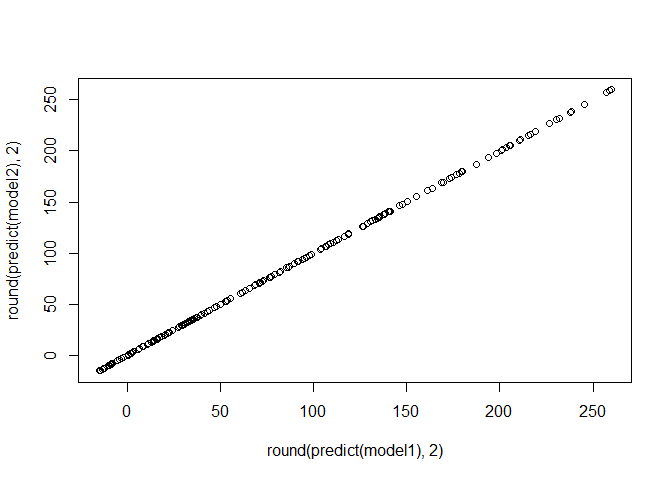
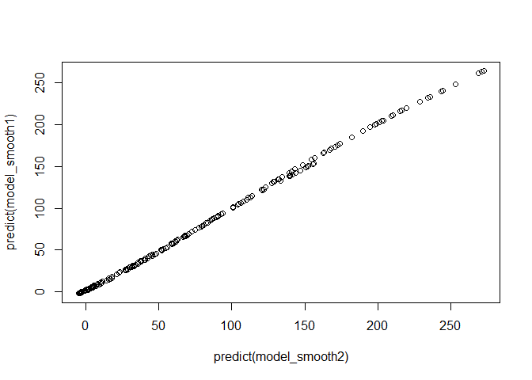
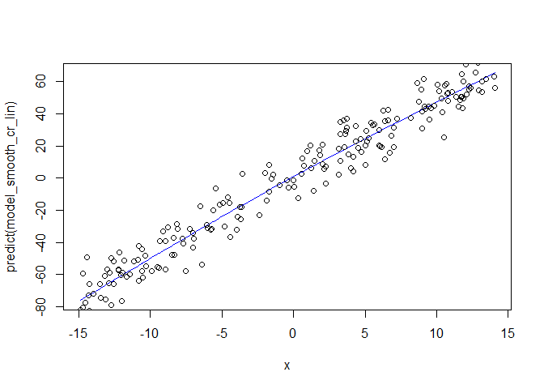
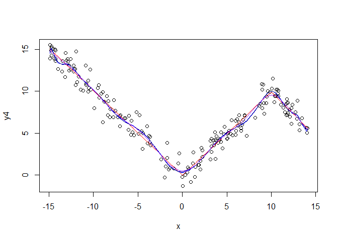
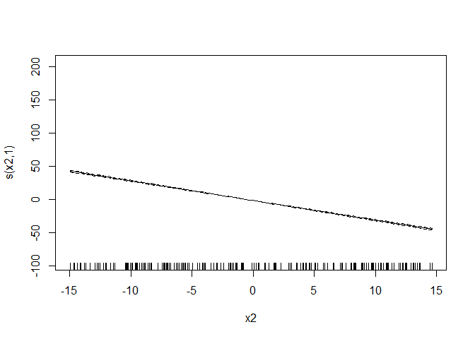

Splines and GAM
================
Lemariey
2023-06-08

``` r
library(gam)
```

    ## Warning: le package 'gam' a été compilé avec la version R 4.2.3

    ## Le chargement a nécessité le package : splines

    ## Le chargement a nécessité le package : foreach

    ## Warning: le package 'foreach' a été compilé avec la version R 4.2.3

    ## Loaded gam 1.22-2

``` r
library(splines)
library(mgcv)
```

    ## Warning: le package 'mgcv' a été compilé avec la version R 4.2.3

    ## Le chargement a nécessité le package : nlme

    ## This is mgcv 1.8-42. For overview type 'help("mgcv-package")'.

    ## 
    ## Attachement du package : 'mgcv'

    ## Les objets suivants sont masqués depuis 'package:gam':
    ## 
    ##     gam, gam.control, gam.fit, s

``` r
library(schoenberg)
```

    ## Warning: le package 'schoenberg' a été compilé avec la version R 4.2.3

    ## -----------------------------------------------------  schoenberg version 2.0.2  --

    ## Please report any bugs or feature requests to github.com/jadahlke/schoenberg/issues

\#Splines You divise the x axis in k knot, and you fit k+1 functions
(one for each part) h1…hk+1

Then the prediction is equal to Y=B0+B1\* h1+…+Bk \*hk

In general, if we want to fit polynom with degree d, you want the
continuty of derivative until degree d-1. So with degree d and k knot,
you have (k+1)\* (d+1) params and k\*(d) constraints so there is k+d+1
ddl.

A spline (linearity constrainst) is different from a piecewise
polynomial regression (no constraint of linearity, more freedom in
parameter).

The base of functions that assures linearity constraints is : h1=1 h2=X
… hd+1=x**d hd+1+1=(x-E1)+**d … hd+1+k=(x-Ek)+\*\*d

The spline model is therefore just like a linear model with new
variable.

\#example

``` r
x<-sort(runif(200,-15,15))
y<-2+5*x+1*x*x+rnorm(200,sd=20)
reely<-2+5*x+1*x*x
plot(x,y)
lines(x,reely,col="red")
```

<!-- -->

\#M splines ( the simpliest basis)

``` r
knot<-c(-5,5)
d<-1
X1<-outer(x,1:d,"^")
X2<-outer(x,knot,">=")*outer(x,knot,"-")^d

msplines<-cbind(1,X1,X2)
fit_msplines<-lm(y~.,data=data.frame(msplines))
summary(fit_msplines)
```

    ## 
    ## Call:
    ## lm(formula = y ~ ., data = data.frame(msplines))
    ## 
    ## Residuals:
    ##     Min      1Q  Median      3Q     Max 
    ## -45.777 -13.712   0.245  11.742  52.354 
    ## 
    ## Coefficients: (1 not defined because of singularities)
    ##              Estimate Std. Error t value Pr(>|t|)    
    ## (Intercept) -105.2962     6.8013  -15.48   <2e-16 ***
    ## X1                 NA         NA      NA       NA    
    ## X2           -16.2445     0.6856  -23.69   <2e-16 ***
    ## X3            22.3147     1.1750   18.99   <2e-16 ***
    ## X4            18.9007     1.1222   16.84   <2e-16 ***
    ## ---
    ## Signif. codes:  0 '***' 0.001 '**' 0.01 '*' 0.05 '.' 0.1 ' ' 1
    ## 
    ## Residual standard error: 19.9 on 196 degrees of freedom
    ## Multiple R-squared:  0.9468, Adjusted R-squared:  0.946 
    ## F-statistic:  1164 on 3 and 196 DF,  p-value: < 2.2e-16

\#exemple with spline k=2 and degree=1 \#bsplines

``` r
fit_bs<-lm(y~bs(x,knots=knot,degree=1,intercept=T))
bsplines<-bs(x,knots=knot,degree=1,intercept=T)
summary(fit_bs)
```

    ## 
    ## Call:
    ## lm(formula = y ~ bs(x, knots = knot, degree = 1, intercept = T))
    ## 
    ## Residuals:
    ##     Min      1Q  Median      3Q     Max 
    ## -45.777 -13.712   0.245  11.742  52.354 
    ## 
    ## Coefficients: (1 not defined because of singularities)
    ##                                                 Estimate Std. Error t value
    ## (Intercept)                                      286.211      4.324   66.19
    ## bs(x, knots = knot, degree = 1, intercept = T)1 -148.234      6.299  -23.53
    ## bs(x, knots = knot, degree = 1, intercept = T)2 -310.285      5.345  -58.05
    ## bs(x, knots = knot, degree = 1, intercept = T)3 -249.582      6.460  -38.63
    ## bs(x, knots = knot, degree = 1, intercept = T)4       NA         NA      NA
    ##                                                 Pr(>|t|)    
    ## (Intercept)                                       <2e-16 ***
    ## bs(x, knots = knot, degree = 1, intercept = T)1   <2e-16 ***
    ## bs(x, knots = knot, degree = 1, intercept = T)2   <2e-16 ***
    ## bs(x, knots = knot, degree = 1, intercept = T)3   <2e-16 ***
    ## bs(x, knots = knot, degree = 1, intercept = T)4       NA    
    ## ---
    ## Signif. codes:  0 '***' 0.001 '**' 0.01 '*' 0.05 '.' 0.1 ' ' 1
    ## 
    ## Residual standard error: 19.9 on 196 degrees of freedom
    ## Multiple R-squared:  0.9468, Adjusted R-squared:  0.946 
    ## F-statistic:  1164 on 3 and 196 DF,  p-value: < 2.2e-16

``` r
predict_bsplines<-predict(fit_bs)
plot(x,predict_bsplines)
lines(x,reely,col="red")
```

<!-- --> The
function bs build the splines basis ( B basis) variables.

\#comparison

``` r
predict_msplines<-predict(fit_msplines)
plot(predict_bsplines,predict_msplines)
```

<!-- -->

``` r
plot(x,bsplines[,1],type="l",main="Bsplines basis",ylim=c(-2,2))
lines(x,bsplines[,2],col="red")
lines(x,bsplines[,3],col="blue")
lines(x,bsplines[,4],col="green")
```

<!-- -->

``` r
plot(x,msplines[,1],type="l",main="Msplines basis",ylim=c(-2,2))
lines(x,msplines[,2],col="red")
lines(x,msplines[,3],col="blue")
lines(x,msplines[,4],col="green")
```

<!-- -->
Bsplines basis is defines by recursivity. CF wikipedia From the initial
knot, you get the knot + boundaries (adding the extrem value). Then from
the knot with boundaries you can get the knot vector (). There is
different way of construction (uniform,open uniform,non uniform) it
contains knot+boundaries+d+1 points.

*always between -1 and 1 *for each x value, there is only d+1 non nul
basis functions. source:
<https://www.ibiblio.org/e-notes/Splines/basis.html#>:\~:text=P(t)%20%3D%20%E2%88%91i,t%20%E2%89%A4%20tn%2B1%20.&text=Ni%2Ck%20is%20a,t%20%3C%20ti%2B1.
We obtain the same models but with 2 different basis.

\#bsplines2

``` r
bsplines2<-bs(x,knots=c(-5,5),degree=2,intercept=T)
plot(x,bsplines2[,1],type="l",main="Bsplines basis",ylim=c(-2,2))
lines(x,bsplines2[,2],col="red")
lines(x,bsplines2[,3],col="blue")
lines(x,bsplines2[,4],col="green")
lines(x,bsplines2[,5],col="purple")
```

<!-- -->

``` r
bsplines2<-bs(x,knots=c(-5,0,5),degree=1,intercept=T)
plot(x,bsplines2[,1],type="l",main="Bsplines basis",ylim=c(-2,2))
lines(x,bsplines2[,2],col="red")
lines(x,bsplines2[,3],col="blue")
lines(x,bsplines2[,4],col="green")
lines(x,bsplines2[,5],col="purple")
abline(v=c(-5,0,5))
```

<!-- --> The
B basis are done with with open uniform knots. ( repetion of the extrem
knots)

The natural splines are a bit different. Not only the basis change but
also “the space”. Indeed these times the polynom on the extrem part are
in degree (d-1)/2. We keep the same constrain on the knot ( derivative 0
until (d-1) are continu). There is less parameter than an m or bsplines.

\#natural splines

``` r
#with this function, you can only have degree 3. 
#With this functionit is a b spline
natural<-data.frame(ns(x,knots=c(-5,0,5),intercept=T,Boundary.knots=c(-10,10)))
fit_natural<-lm(y~.,data=natural)
dim(natural)
```

    ## [1] 200   5

``` r
plot(x,natural[,1],type="l")
lines(x,natural[,2],col="red")
lines(x,natural[,3],col="blue")
lines(x,natural[,4],col="green")
lines(x,natural[,5],col="orange")
```

<!-- -->

``` r
predict_natural_splines<-predict(fit_natural)
plot(x,predict_natural_splines)
lines(x,reely,col="red")
abline(v=c(-10,10))
abline(v=c(-5,0,5))
```

<!-- -->

``` r
plot(x,predict_natural_splines,xlim=c(-10,-5),ylim=c(0,100))
lines(x,reely,col="red")
```

<!-- -->
\#here there is k=3 and d=3 2+4+4+4+4+2=20 params 3\*5knots=15
constraints 20-15=5 functions

\#GAM model then on the splines new variables we can apply a lm or a
smooth.

``` r
bsplines<-bs(x,knots=knot,degree=1,intercept=F)
model1<-lm(formula=y~bsplines)
summary(model1)
```

    ## 
    ## Call:
    ## lm(formula = y ~ bsplines)
    ## 
    ## Residuals:
    ##     Min      1Q  Median      3Q     Max 
    ## -45.777 -13.712   0.245  11.742  52.354 
    ## 
    ## Coefficients:
    ##             Estimate Std. Error t value Pr(>|t|)    
    ## (Intercept)  137.977      4.360   31.65   <2e-16 ***
    ## bsplines1   -162.051      6.840  -23.69   <2e-16 ***
    ## bsplines2   -101.348      5.181  -19.56   <2e-16 ***
    ## bsplines3    148.234      6.299   23.53   <2e-16 ***
    ## ---
    ## Signif. codes:  0 '***' 0.001 '**' 0.01 '*' 0.05 '.' 0.1 ' ' 1
    ## 
    ## Residual standard error: 19.9 on 196 degrees of freedom
    ## Multiple R-squared:  0.9468, Adjusted R-squared:  0.946 
    ## F-statistic:  1164 on 3 and 196 DF,  p-value: < 2.2e-16

``` r
model2<-gam(formula=y~bsplines)
summary(model2)
```

    ## 
    ## Family: gaussian 
    ## Link function: identity 
    ## 
    ## Formula:
    ## y ~ bsplines
    ## 
    ## Parametric coefficients:
    ##             Estimate Std. Error t value Pr(>|t|)    
    ## (Intercept)  137.977      4.360   31.65   <2e-16 ***
    ## bsplines1   -162.051      6.840  -23.69   <2e-16 ***
    ## bsplines2   -101.348      5.181  -19.56   <2e-16 ***
    ## bsplines3    148.234      6.299   23.53   <2e-16 ***
    ## ---
    ## Signif. codes:  0 '***' 0.001 '**' 0.01 '*' 0.05 '.' 0.1 ' ' 1
    ## 
    ## 
    ## R-sq.(adj) =  0.946   Deviance explained = 94.7%
    ## GCV = 404.07  Scale est. = 395.99    n = 200

``` r
plot(round(predict(model1),2),round(predict(model2),2))
```

<!-- -->

``` r
table(round(predict(model1),3)==round(predict(model2),3))
```

    ## 
    ## TRUE 
    ##  200

``` r
d<-data.frame(predict(model1),predict(model2))


plot(x,predict(model2),type="l",col="blue")
points(x,y)
```

<!-- -->
Model 1 and model 2 are the same, but with gam function, the intercept
is computed also and therefore the splines coefficients are a bit
different.

One of the drawback of gam is for interaction, even if we can add
interaction term manually in the model.

\#smooth bs penalty for smooth with a b spline basis and use the
integral of the second derivative \#compare smooth with just a spline

``` r
model_smooth1<-gam(y~s(x,bs="bs"))
summary(model_smooth1)
```

    ## 
    ## Family: gaussian 
    ## Link function: identity 
    ## 
    ## Formula:
    ## y ~ s(x, bs = "bs")
    ## 
    ## Parametric coefficients:
    ##             Estimate Std. Error t value Pr(>|t|)    
    ## (Intercept)   79.004      1.348   58.59   <2e-16 ***
    ## ---
    ## Signif. codes:  0 '***' 0.001 '**' 0.01 '*' 0.05 '.' 0.1 ' ' 1
    ## 
    ## Approximate significance of smooth terms:
    ##        edf Ref.df     F p-value    
    ## s(x) 4.875  5.802 653.8  <2e-16 ***
    ## ---
    ## Signif. codes:  0 '***' 0.001 '**' 0.01 '*' 0.05 '.' 0.1 ' ' 1
    ## 
    ## R-sq.(adj) =   0.95   Deviance explained = 95.2%
    ## GCV = 374.69  Scale est. = 363.68    n = 200

``` r
coef(model_smooth1)#10 coefficients
```

    ## (Intercept)      s(x).1      s(x).2      s(x).3      s(x).4      s(x).5 
    ##    79.00376    34.39440   -80.16158  -126.83786  -149.31141  -122.09144 
    ##      s(x).6      s(x).7      s(x).8      s(x).9 
    ##   -53.04371    42.77093   185.11738   331.16538

``` r
model_smooth2<-gam(y~s(x,bs="bs",k=5))#k=5 mini
summary(model_smooth2)
```

    ## 
    ## Family: gaussian 
    ## Link function: identity 
    ## 
    ## Formula:
    ## y ~ s(x, bs = "bs", k = 5)
    ## 
    ## Parametric coefficients:
    ##             Estimate Std. Error t value Pr(>|t|)    
    ## (Intercept)   79.004      1.355   58.31   <2e-16 ***
    ## ---
    ## Signif. codes:  0 '***' 0.001 '**' 0.01 '*' 0.05 '.' 0.1 ' ' 1
    ## 
    ## Approximate significance of smooth terms:
    ##       edf Ref.df   F p-value    
    ## s(x) 3.82   3.98 948  <2e-16 ***
    ## ---
    ## Signif. codes:  0 '***' 0.001 '**' 0.01 '*' 0.05 '.' 0.1 ' ' 1
    ## 
    ## R-sq.(adj) =   0.95   Deviance explained = 95.1%
    ## GCV = 376.24  Scale est. = 367.17    n = 200

``` r
coef(model_smooth2)#5 coefficients
```

    ## (Intercept)      s(x).1      s(x).2      s(x).3      s(x).4 
    ##    79.00376  -206.96663  -552.51093   -20.76839   714.39829

``` r
plot(x,predict(model2),type="l",col="blue")
lines(x,predict(model_smooth1),col="red")
lines(x,predict(model_smooth2),col="green")
points(x,y)
```

<!-- -->

``` r
plot(predict(model_smooth2),predict(model_smooth1))
```

<!-- -->

``` r
table(predict(model_smooth2)==predict(model_smooth1))
```

    ## 
    ## FALSE 
    ##   200

``` r
d<-data.frame(predict(model_smooth2),predict(model_smooth1))
#ce ne sont pas les memes foncitons
```

K is the maximum edf, it’s the number of function in the basis.

edf =2 it’s similar to a linear regression with 1 inetrcept and 1 lin
param.

In linear model edf=trace(hatmatrix) because trace(AB) =trace(BA)p In
smooth regression edf = trace (pseudo hat matrix)

\#comparison of smooth type

``` r
model_smooth_bs<-gam(y~s(x,bs="bs",k=5))#k=5 mini
summary(model_smooth_bs)
```

    ## 
    ## Family: gaussian 
    ## Link function: identity 
    ## 
    ## Formula:
    ## y ~ s(x, bs = "bs", k = 5)
    ## 
    ## Parametric coefficients:
    ##             Estimate Std. Error t value Pr(>|t|)    
    ## (Intercept)   79.004      1.355   58.31   <2e-16 ***
    ## ---
    ## Signif. codes:  0 '***' 0.001 '**' 0.01 '*' 0.05 '.' 0.1 ' ' 1
    ## 
    ## Approximate significance of smooth terms:
    ##       edf Ref.df   F p-value    
    ## s(x) 3.82   3.98 948  <2e-16 ***
    ## ---
    ## Signif. codes:  0 '***' 0.001 '**' 0.01 '*' 0.05 '.' 0.1 ' ' 1
    ## 
    ## R-sq.(adj) =   0.95   Deviance explained = 95.1%
    ## GCV = 376.24  Scale est. = 367.17    n = 200

``` r
coef(model_smooth_bs)#5 coefficients
```

    ## (Intercept)      s(x).1      s(x).2      s(x).3      s(x).4 
    ##    79.00376  -206.96663  -552.51093   -20.76839   714.39829

``` r
model_smooth_tp<-gam(y~s(x,bs="tp",k=5))#k=5 mini
summary(model_smooth_tp)
```

    ## 
    ## Family: gaussian 
    ## Link function: identity 
    ## 
    ## Formula:
    ## y ~ s(x, bs = "tp", k = 5)
    ## 
    ## Parametric coefficients:
    ##             Estimate Std. Error t value Pr(>|t|)    
    ## (Intercept)   79.004      1.351   58.49   <2e-16 ***
    ## ---
    ## Signif. codes:  0 '***' 0.001 '**' 0.01 '*' 0.05 '.' 0.1 ' ' 1
    ## 
    ## Approximate significance of smooth terms:
    ##        edf Ref.df     F p-value    
    ## s(x) 3.868   3.99 951.6  <2e-16 ***
    ## ---
    ## Signif. codes:  0 '***' 0.001 '**' 0.01 '*' 0.05 '.' 0.1 ' ' 1
    ## 
    ## R-sq.(adj) =   0.95   Deviance explained = 95.1%
    ## GCV = 373.93  Scale est. = 364.82    n = 200

``` r
coef(model_smooth_tp)#5 coefficients
```

    ## (Intercept)      s(x).1      s(x).2      s(x).3      s(x).4 
    ##   79.003762    1.406659 -106.897158 -321.014833   36.747574

``` r
model_smooth_cr<-gam(y~s(x,bs="cr",k=5))#k=5 mini
summary(model_smooth_cr)
```

    ## 
    ## Family: gaussian 
    ## Link function: identity 
    ## 
    ## Formula:
    ## y ~ s(x, bs = "cr", k = 5)
    ## 
    ## Parametric coefficients:
    ##             Estimate Std. Error t value Pr(>|t|)    
    ## (Intercept)   79.004      1.353    58.4   <2e-16 ***
    ## ---
    ## Signif. codes:  0 '***' 0.001 '**' 0.01 '*' 0.05 '.' 0.1 ' ' 1
    ## 
    ## Approximate significance of smooth terms:
    ##        edf Ref.df     F p-value    
    ## s(x) 3.856  3.988 948.5  <2e-16 ***
    ## ---
    ## Signif. codes:  0 '***' 0.001 '**' 0.01 '*' 0.05 '.' 0.1 ' ' 1
    ## 
    ## R-sq.(adj) =   0.95   Deviance explained = 95.1%
    ## GCV = 375.16  Scale est. = 366.05    n = 200

``` r
coef(model_smooth_cr)#5 coefficients
```

    ## (Intercept)      s(x).1      s(x).2      s(x).3      s(x).4 
    ##   79.003762  -76.910342 -112.117802   -9.947934  200.142637

``` r
plot(x,predict(model_smooth_bs),type="l",col="blue")
lines(x,predict(model_smooth_tp),col="red")
lines(x,predict(model_smooth_cr),col="green")
points(x,y)
```

<!-- -->

\#study smooth object

``` r
smooths<-s(x,bs="cr",k=3)
smooths$bs.dim
```

    ## [1] 3

``` r
smooths$dim
```

    ## [1] 1

``` r
smooths$id
```

    ## NULL

\#try with linear effect

``` r
y2<-2+5*x+rnorm(200,sd=10)-3
reely2<-2+5*x

model_smooth_cr_lin<-gam(y2~s(x,bs="cr",k=100))#k=3 mini
summary(model_smooth_cr_lin)
```

    ## 
    ## Family: gaussian 
    ## Link function: identity 
    ## 
    ## Formula:
    ## y2 ~ s(x, bs = "cr", k = 100)
    ## 
    ## Parametric coefficients:
    ##             Estimate Std. Error t value Pr(>|t|)   
    ## (Intercept)  -2.4789     0.7613  -3.256  0.00133 **
    ## ---
    ## Signif. codes:  0 '***' 0.001 '**' 0.01 '*' 0.05 '.' 0.1 ' ' 1
    ## 
    ## Approximate significance of smooth terms:
    ##      edf Ref.df    F p-value    
    ## s(x)   1      1 3480  <2e-16 ***
    ## ---
    ## Signif. codes:  0 '***' 0.001 '**' 0.01 '*' 0.05 '.' 0.1 ' ' 1
    ## 
    ## R-sq.(adj) =  0.946   Deviance explained = 94.6%
    ## GCV = 117.09  Scale est. = 115.92    n = 200

``` r
coef(model_smooth_cr_lin)#5 coefficients
```

    ## (Intercept)      s(x).1      s(x).2      s(x).3      s(x).4      s(x).5 
    ##  -2.4788644 -56.6807619 -70.0024966 -64.6936640 -64.1442428 -58.4773840 
    ##      s(x).6      s(x).7      s(x).8      s(x).9     s(x).10     s(x).11 
    ## -56.8020456 -51.3758881 -55.5947839 -48.5566763 -54.7140104 -49.4439021 
    ##     s(x).12     s(x).13     s(x).14     s(x).15     s(x).16     s(x).17 
    ## -49.8305434 -48.3528455 -46.5916012 -45.4422724 -48.1006865 -40.6197544 
    ##     s(x).18     s(x).19     s(x).20     s(x).21     s(x).22     s(x).23 
    ## -43.3162490 -39.7909260 -44.5303973 -38.9743077 -39.6208070 -39.0638362 
    ##     s(x).24     s(x).25     s(x).26     s(x).27     s(x).28     s(x).29 
    ## -35.8351214 -35.7569277 -33.8424527 -34.7697590 -31.3748607 -29.8903960 
    ##     s(x).30     s(x).31     s(x).32     s(x).33     s(x).34     s(x).35 
    ## -28.8871917 -26.8516994 -24.6189375 -23.3676109 -22.9859351 -17.9434409 
    ##     s(x).36     s(x).37     s(x).38     s(x).39     s(x).40     s(x).41 
    ## -18.0636700  -8.8127618 -11.5078990  -6.8732564 -10.3297308  -5.1309567 
    ##     s(x).42     s(x).43     s(x).44     s(x).45     s(x).46     s(x).47 
    ##  -4.9283629  -1.6024179   0.3367039   1.3603613   1.7103450   5.8687392 
    ##     s(x).48     s(x).49     s(x).50     s(x).51     s(x).52     s(x).53 
    ##   3.5073334   6.6550655  10.4000508   5.1150922  13.8197603  10.5657942 
    ##     s(x).54     s(x).55     s(x).56     s(x).57     s(x).58     s(x).59 
    ##  12.4392099  12.5440808  16.4365648  17.2962670  19.0356569  17.7989002 
    ##     s(x).60     s(x).61     s(x).62     s(x).63     s(x).64     s(x).65 
    ##  20.0797549  23.4001355  21.9355253  25.7192432  24.9235834  28.4339354 
    ##     s(x).66     s(x).67     s(x).68     s(x).69     s(x).70     s(x).71 
    ##  24.6372104  27.8322161  34.1639710  32.6845912  38.6204975  36.4423164 
    ##     s(x).72     s(x).73     s(x).74     s(x).75     s(x).76     s(x).77 
    ##  46.7788199  42.4107809  47.0014472  47.7227940  48.0485574  52.8167889 
    ##     s(x).78     s(x).79     s(x).80     s(x).81     s(x).82     s(x).83 
    ##  49.5460041  53.7691308  53.5422904  57.9142465  53.4118587  61.4874342 
    ##     s(x).84     s(x).85     s(x).86     s(x).87     s(x).88     s(x).89 
    ##  61.1983920  64.6715493  64.0152411  69.3249287  68.5683914  74.8668815 
    ##     s(x).90     s(x).91     s(x).92     s(x).93     s(x).94     s(x).95 
    ##  70.9042602  76.5947528  74.9036330  75.9806135  77.4019345  82.3062055 
    ##     s(x).96     s(x).97     s(x).98     s(x).99 
    ##  74.8385787  85.2774631  85.1323261  81.3704942

``` r
plot(x,predict(model_smooth_cr_lin),type="l",col="blue")
points(x,y2)
```

<!-- -->

``` r
summary<-summary(model_smooth_cr_lin)
summary$s.table
```

    ##           edf   Ref.df        F p-value
    ## s(x) 1.000002 1.000004 3479.988       0

``` r
summary$se
```

    ## (Intercept)      s(x).1      s(x).2      s(x).3      s(x).4      s(x).5 
    ## 0.761304851 0.960829587 1.186654326 1.096661049 1.087347412 0.991284978 
    ##      s(x).6      s(x).7      s(x).8      s(x).9     s(x).10     s(x).11 
    ## 0.962885006 0.870902868 0.942419871 0.823112684 0.927489308 0.838152529 
    ##     s(x).12     s(x).13     s(x).14     s(x).15     s(x).16     s(x).17 
    ## 0.844706703 0.819657333 0.789801417 0.770318458 0.815382771 0.688569114 
    ##     s(x).18     s(x).19     s(x).20     s(x).21     s(x).22     s(x).23 
    ## 0.734278952 0.674519165 0.754860681 0.660676200 0.671635381 0.662193855 
    ##     s(x).24     s(x).25     s(x).26     s(x).27     s(x).28     s(x).29 
    ## 0.607462100 0.606136604 0.573683289 0.589402587 0.531853830 0.506689900 
    ##     s(x).30     s(x).31     s(x).32     s(x).33     s(x).34     s(x).35 
    ## 0.489684105 0.455179443 0.417330842 0.396119042 0.389649088 0.304171715 
    ##     s(x).36     s(x).37     s(x).38     s(x).39     s(x).40     s(x).41 
    ## 0.306209781 0.149396415 0.195081244 0.116520929 0.175110070 0.086989368 
    ##     s(x).42     s(x).43     s(x).44     s(x).45     s(x).46     s(x).47 
    ## 0.083555141 0.027202223 0.005895686 0.023108089 0.029029763 0.099496165 
    ##     s(x).48     s(x).49     s(x).50     s(x).51     s(x).52     s(x).53 
    ## 0.059472631 0.112823961 0.176304078 0.086719875 0.234272042 0.179112996 
    ##     s(x).54     s(x).55     s(x).56     s(x).57     s(x).58     s(x).59 
    ## 0.210869536 0.212646796 0.278629654 0.293202521 0.322687669 0.301722656 
    ##     s(x).60     s(x).61     s(x).62     s(x).63     s(x).64     s(x).65 
    ## 0.340386540 0.396671696 0.371844151 0.435983788 0.422496039 0.482001959 
    ##     s(x).66     s(x).67     s(x).68     s(x).69     s(x).70     s(x).71 
    ## 0.417641391 0.471801663 0.579134412 0.554056350 0.654679292 0.617755487 
    ##     s(x).72     s(x).73     s(x).74     s(x).75     s(x).76     s(x).77 
    ## 0.792975256 0.718930016 0.796749041 0.808976954 0.814499096 0.895328117 
    ##     s(x).78     s(x).79     s(x).80     s(x).81     s(x).82     s(x).83 
    ## 0.839883144 0.911471775 0.907626470 0.981738007 0.905415472 1.042309171 
    ##     s(x).84     s(x).85     s(x).86     s(x).87     s(x).88     s(x).89 
    ## 1.037409506 1.096285030 1.085159764 1.175167310 1.162342883 1.269112291 
    ##     s(x).90     s(x).91     s(x).92     s(x).93     s(x).94     s(x).95 
    ## 1.201939865 1.298402603 1.269735545 1.287992194 1.312085946 1.395221063 
    ##     s(x).96     s(x).97     s(x).98     s(x).99 
    ## 1.268633570 1.445588686 1.443128555 1.379359923

``` r
summary$edf
```

    ## [1] 1.000002

Even if we choose K very big, it’s prevent overfitting contrary to
polynomial regression.

\#try with cst piecewise

``` r
y3<-x*(x>0)-5*x*(x<0)+rnorm(200,sd=3)
reely3<-x*(x>0)-5*x*(x<0)

#smoooth with cr
model_smooth_cr_cst2<-gam(y3~s(x,bs="cr",k=5))
pred_smooth_2<-predict(model_smooth_cr_cst2)
length(coef(model_smooth_cr_cst2))
```

    ## [1] 5

``` r
#third smooth splines with bs
model_smooth_bs3<-gam(y3~s(x,bs="bs",k=5))#k=5 mini
pred_smooth_3<-predict(model_smooth_bs3)
length(coef(model_smooth_bs3))
```

    ## [1] 5

``` r
s<-summary(model_smooth_bs3)
s$edf
```

    ## [1] 3.967471

``` r
#spline non lissé
fit_bs<-lm(y3~bs(x,knots=2,degree=2,intercept=T))
predict_bsplines<-predict(fit_bs)
length(coef(fit_bs))
```

    ## [1] 5

``` r
#model quadratique
quad_model<-lm(y3~poly(x,2))
pred_quad<-predict(quad_model)
cubic_model<-lm(y3~poly(x,3))
pred_cub<-predict(cubic_model)
lin4<-lm(y3~poly(x,4))
pred_lin4<-predict(lin4)


#comparison of function with 5 parameter
plot(x,y3)
lines(x,pred_quad,col="orange")
lines(x,pred_cub,col="firebrick1")
lines(x,pred_lin4,col="firebrick4")
```

<!-- -->

``` r
plot(x,y3)
lines(x,pred_smooth_2,col="royalblue1")
lines(x,pred_smooth_3,col="royalblue4")
lines(x,predict_bsplines,col="blue")
```

<!-- -->

``` r
summary<-summary(model_smooth_cr_cst2)
summary$s.table
```

    ##           edf   Ref.df        F p-value
    ## s(x) 3.976488 3.999667 2689.384       0

``` r
summary$se
```

    ## (Intercept)      s(x).1      s(x).2      s(x).3      s(x).4 
    ##   0.2202482   0.7122994   0.5593942   0.6623656   0.7966333

``` r
summary$edf
```

    ## [1] 3.976488

``` r
coef(model_smooth_cr_cst2)
```

    ## (Intercept)      s(x).1      s(x).2      s(x).3      s(x).4 
    ##    24.01567    -4.36731   -42.30330   -39.72426   -18.01507

A smooth spline with k =3 is closer to a quadratic regression than a
spline regression with k=3 basis functions. Why ? Maybe cause in smoooth
regression, the function should be derivable twice. And the splines with
knot is not derivable.

\#prediction

``` r
res<-predict.gam(model_smooth_cr,se.fit=T)
se<-res$se.fit
```

\#3 part y In this section we increase the complexity of the real model
and compare once again gam with polynomial regression.

``` r
y4<--x*(x<(0))+x*(x>0)+(-2*x+20)*(x>10)+rnorm(200,sd=1)
plot(x,y4)


#model quadratique
cubic_model<-lm(y4~poly(x,3))
pred_cub<-predict(cubic_model)
lin4<-lm(y4~poly(x,4))
pred_lin4<-predict(lin4)
lin5<-lm(y4~poly(x,20))
pred_lin5<-predict(lin5)

#spline non lissé good model
fit_bs<-lm(y4~bs(x,knots=c(0,10),degree=1,intercept=T))
predict_bsplines<-predict(fit_bs)

#smooth splines
model_smooth_bs3<-gam(y4~s(x,bs="cr",k=20))#k=5 mini
pred_smooth_3<-predict(model_smooth_bs3)
summary(model_smooth_bs3)$edf
```

    ## [1] 11.42941

``` r
#overfitetd model non smooth
fit_bs_over<-lm(y4~bs(x,knots=c(0,10),degree=17,intercept=T))
predict_bsplines_over<-predict(fit_bs_over)

plot(x,y4)
lines(x,predict_bsplines,col="red")#fit the good model
lines(x,pred_lin5,col="blue")
lines(x,predict_bsplines_over,col="darkblue")
lines(x,pred_smooth_3,col="purple")
```

<!-- -->

A smooth spline with k =3 is closer to a quadratic regression than a
spline regression with k=3 basis functions. Why ? Maybe cause in smoooth
regression, the function should be derivable twice. And the splines with
knot is not derivable.

\#prediction

``` r
p <- predict(model_smooth_bs3, type = "link", se.fit = TRUE)
#95% use normal approximation
upr <- p$fit + (2 * p$se.fit)
lwr <- p$fit - (2 * p$se.fit)
#other way 
#https://www.r-bloggers.com/2019/08/prediction-intervals-for-generalized-additive-models-gams/


#on ne peut pas approximer par une student 
qt(c(0.025,0.975),200-20)*p$se.fit[1]+p$fit[1]
```

    ## [1] 14.25699 15.94475

``` r
qt(c(0.025,0.975),200-13.43)*p$se.fit[1]+p$fit[1]
```

    ## [1] 14.25719 15.94455

``` r
plot(x,predict(model_smooth_bs3))
lines(x,upr,col="red")
lines(x,lwr,col="red")
```

<!-- -->
Prediction interval with only spline its just like a regression with
different variable and therefore you can use student law for confidence
and prediction intervals.

\#interaction

``` r
x<-sort(runif(200,-15,15))
x2<-runif(200,-15,15)
y<-2+5*x+1*x*x+rnorm(200,sd=2)-3*x2
reely<-2+5*x+1*x*x-3*x2
plot(x,y)
```

<!-- -->

``` r
plot(x2,y)
```

<!-- -->

``` r
#only interaction terms
gam_inter<-gam(y~te(x,x2,k=3,bs="cr"))
length(coef(gam_inter))
```

    ## [1] 9

``` r
summary(gam_inter)
```

    ## 
    ## Family: gaussian 
    ## Link function: identity 
    ## 
    ## Formula:
    ## y ~ te(x, x2, k = 3, bs = "cr")
    ## 
    ## Parametric coefficients:
    ##             Estimate Std. Error t value Pr(>|t|)    
    ## (Intercept)  73.1384     0.3929   186.2   <2e-16 ***
    ## ---
    ## Signif. codes:  0 '***' 0.001 '**' 0.01 '*' 0.05 '.' 0.1 ' ' 1
    ## 
    ## Approximate significance of smooth terms:
    ##          edf Ref.df    F p-value    
    ## te(x,x2)   5      5 9312  <2e-16 ***
    ## ---
    ## Signif. codes:  0 '***' 0.001 '**' 0.01 '*' 0.05 '.' 0.1 ' ' 1
    ## 
    ## R-sq.(adj) =  0.996   Deviance explained = 99.6%
    ## GCV = 31.827  Scale est. = 30.872    n = 200

``` r
pred<-predict(gam_inter)
plot(x,pred,ylim=c(-50,300))
points(x,y,col="red")
```

<!-- -->

``` r
plot(x2,pred,ylim=c(-50,300))
points(x2,y,col="red")
```

<!-- -->

``` r
plot(pred,y)
```

<!-- --> te
for main effect + interaction. number of coeffcient is 1 ( intercept) +
(k-1) factor 1 +(k-1) factor 2 + (k-1)^2 factor 1\*factor 2

ti for interaction only number of coeffcient is 1 ( intercept) + (k-1)
factor 1 +(k-1) factor 2 + (k-1)^2 factor 1\*factor 2

``` r
#only interaction terms
gam_inter<-gam(y~ti(x,x2,k=3,bs="cr"))
length(coef(gam_inter))
```

    ## [1] 5

``` r
summary(gam_inter)$edf
```

    ## [1] 1.251004

``` r
gam_inter<-gam(y~te(x,x2,k=4,bs="cr"))
length(coef(gam_inter))
```

    ## [1] 16

``` r
summary(gam_inter)$edf
```

    ## [1] 6.987042

\#comparison lin vs gam (splines) vs gam smooth

``` r
spline_x1<-bs(x,knots=c(-2),degree=1,intercept=F)
spline_x2<-bs(x2,knots=c(2),degree=1,intercept=F)

#linear model with splines
linear_model<-lm(y~spline_x1+spline_x2)
summary(linear_model)
```

    ## 
    ## Call:
    ## lm(formula = y ~ spline_x1 + spline_x2)
    ## 
    ## Residuals:
    ##     Min      1Q  Median      3Q     Max 
    ## -30.766 -13.990  -4.432  14.439  51.288 
    ## 
    ## Coefficients:
    ##             Estimate Std. Error t value Pr(>|t|)    
    ## (Intercept)  169.486      5.622   30.14   <2e-16 ***
    ## spline_x11  -163.848      5.946  -27.55   <2e-16 ***
    ## spline_x12   123.825      5.244   23.61   <2e-16 ***
    ## spline_x21   -53.587      5.321  -10.07   <2e-16 ***
    ## spline_x22   -89.827      4.908  -18.30   <2e-16 ***
    ## ---
    ## Signif. codes:  0 '***' 0.001 '**' 0.01 '*' 0.05 '.' 0.1 ' ' 1
    ## 
    ## Residual standard error: 19.99 on 195 degrees of freedom
    ## Multiple R-squared:  0.946,  Adjusted R-squared:  0.9449 
    ## F-statistic: 854.3 on 4 and 195 DF,  p-value: < 2.2e-16

``` r
coef(linear_model)
```

    ## (Intercept)  spline_x11  spline_x12  spline_x21  spline_x22 
    ##   169.48592  -163.84765   123.82500   -53.58746   -89.82727

``` r
lin_pred<-predict(linear_model)

#gam with splines
gam_model<-gam(y~spline_x1+spline_x2)
coef(gam_model)
```

    ## (Intercept)  spline_x11  spline_x12  spline_x21  spline_x22 
    ##   169.48592  -163.84765   123.82500   -53.58746   -89.82727

``` r
test<-gam_model$R

#smooth
smooth_x1<-s(x,bs="cr",k=2)#k=5 mini
smooth_x2<-s(x,bs="cr",k=2)
#on ne peut pas les utiliser dans un modèle linéaire.


ms_x1<-gam(y~s(x,bs="cr",k=5))#k=5 mini
ms_x2<-gam(y~s(x2,bs="cr",k=3))
ms_x1x2<-gam(y~s(x,bs="cr",k=3)+s(x2,bs="cr",k=3))
coef(ms_x1)
```

    ## (Intercept)      s(x).1      s(x).2      s(x).3      s(x).4 
    ##  73.1384396 -88.2195071 -88.1471145  -0.5349982 212.0744964

``` r
coef(ms_x2)
```

    ## (Intercept)     s(x2).1     s(x2).2 
    ##    73.13844   -13.73870   -51.64257

``` r
coef(ms_x1x2)
```

    ## (Intercept)      s(x).1      s(x).2     s(x2).1     s(x2).2 
    ##    73.13844  -115.92059   200.97715   -32.00857   -52.53900

``` r
test<-ms_x1$R 

#In linear algebra, a QR decomposition, also known as a QR factorization or QU factorization, is a decomposition of a matrix A into a product A = QR of an orthonormal matrix Q and an upper triangular matrix R.
test2<-ms_x1$var.summary$x


pred_msx1x2<-predict(ms_x1x2)
pred_msx1<-predict(ms_x1)

plot(x,y,ylim=c(-50,300))
points(x,lin_pred,col="red")
points(x,pred_msx1x2,col="blue")
```

<!-- -->

``` r
plot(x2,y,ylim=c(-50,300))
points(x2,lin_pred,col="red")
points(x2,pred_msx1x2,col="blue")
```

<!-- -->

Using gam or lm with 2 splines it’s the same thing.

Using gam with smooth spline is different from gam with normal spline.

the coefficient obtain in ms_x1 and msx2 are logically different from
the one from model mx1x2 which fit all coefficients at once. The basis
of the smooth splines depend on the response y, whereas for normal
spline it depend only on x.

``` r
plot(ms_x1x2)
```

<!-- --><!-- -->

``` r
summary(ms_x1x2)$edf
```

    ## [1] 1.999956 1.000000

``` r
coef(ms_x1x2)
```

    ## (Intercept)      s(x).1      s(x).2     s(x2).1     s(x2).2 
    ##    73.13844  -115.92059   200.97715   -32.00857   -52.53900
