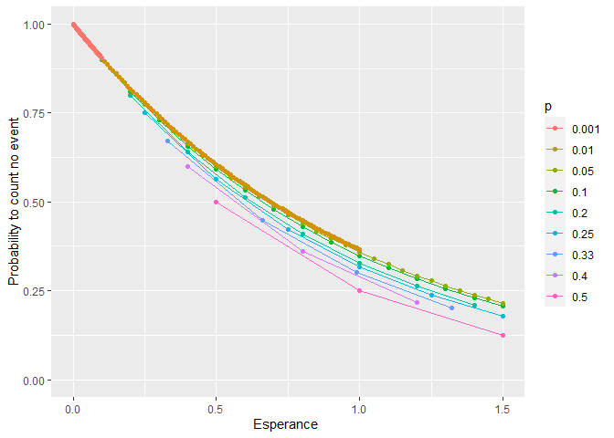

Binomial
================
Lemariey
2022-09-29

``` r
library(ggplot2)
```

# 

``` r
n <- 100
p <- c(0.5,0.4,0.33,0.25,0.2,0.1,0.05,0.01,0.001)
#esperance au bout de 100
espe_100 <- p*n
plot(p,espe_100)
```

<!-- -->

``` r
data <- as.data.frame(matrix(0,ncol=3))
names(data) <- c("x","p","vec")
m <- matrix(0,ncol=n,nrow=length(p))
for (i in  1:n){
  vec<- (1-p)^i
  m[,i] <- vec
  x <- rep(i,length(p))
  data_running <- data.frame(x,p,vec)
  data <- rbind(data,data_running)
}

data_proba <- data[-1,]
data_proba_cate <- data_proba
data_proba_cate$esperance <- data_proba_cate$x*data_proba_cate$p
data_proba_cate$p <- as.character(data_proba_cate$p)
```

\#plot probabality to have no event after k experiment

``` r
p1<-ggplot(data_proba, aes(x=x, y=vec, group=p)) +
  geom_line(aes(color=p))+ylab("Probability to count no event")+xlab("Number of experiment N")
  #geom_point(aes(color=p))
p1
```

<!-- -->

``` r
p2<-ggplot(data_proba_cate, aes(x=x, y=vec, group=p)) +
  geom_line(aes(color=p))+ylab("Probability to count no event")+xlab("Number of experiment N")
  #geom_point(aes(color=p))
p2
```

<!-- -->

``` r
p3<-ggplot(data_proba_cate, aes(x=esperance, y=vec, group=p)) +
  geom_line(aes(color=p))+ylab("Probability to count no event")+xlab("Esperance ")+xlim(c(0,1.5))+
  geom_point(aes(color=p))
p3
```

    ## Warning: Removed 632 row(s) containing missing values (geom_path).

    ## Warning: Removed 632 rows containing missing values (geom_point).

<!-- -->

``` r
#the lower is the probability of the event, the higher is the probability to have no event after N experiment assuring a esperance equal to 1.


xp <- seq(0.001,1,0.001)#event probability 
proba_espe_1 <- (1-xp)**(1/xp)# ca converge vers la limite en 0
plot(xp,proba_espe_1,type="l")
```

<!-- -->

``` r
plot(xp,proba_espe_1,type="l",xlim=c(min(xp),0.01),ylim=c(0.3,0.4))
```

<!-- -->

density n=100

``` r
n=100
data <- as.data.frame(matrix(0,ncol=3))
names(data) <- c("x","i","vec")
m <- matrix(0,ncol=n,nrow=length(p))
for (i in  p){
  vec<- dbinom(0:n,n,i)
  x <- 0:n
  data_running <- data.frame(x,i,vec)
  data <- rbind(data,data_running)
}

data_density <- data[-1,]
names(data_density) <- c("x","p","density")
data_density_cate <- data_density

data_density_cate$p <- as.character(data_density_cate$p)

p4<-ggplot(data_density_cate, aes(x=x, y=density, group=p)) +
  geom_line(aes(color=p))+ylab("Density")+xlab("Number of event observed ")+
  geom_point(aes(color=p))
p4
```

<!-- -->

density n=10

``` r
n=10
data <- as.data.frame(matrix(0,ncol=3))
names(data) <- c("x","i","vec")
m <- matrix(0,ncol=n,nrow=length(p))
for (i in  p){
  vec<- dbinom(0:n,n,i)
  x <- 0:n
  data_running <- data.frame(x,i,vec)
  data <- rbind(data,data_running)
}

data_density <- data[-1,]
names(data_density) <- c("x","p","density")
data_density_cate <- data_density

data_density_cate$p <- as.character(data_density_cate$p)

p4<-ggplot(data_density_cate, aes(x=x, y=density, group=p)) +
  geom_line(aes(color=p))+ylab("Density")+xlab("Number of event observed ")+
  geom_point(aes(color=p))
p4
```

<!-- -->
