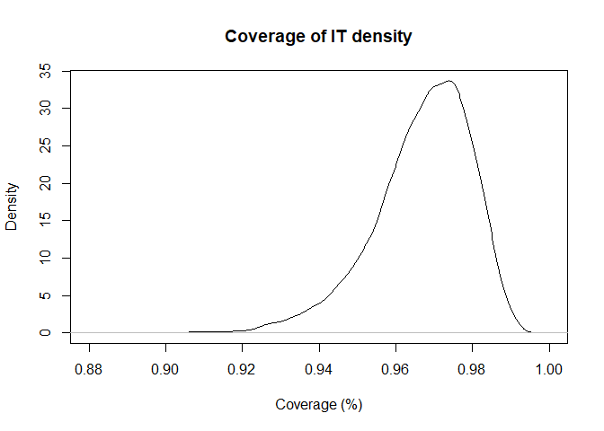

Tolerance Interval
================
Loïc Lemariey
13/05/2022

#load package

``` r
library(tolerance)
```

    ## Warning: le package 'tolerance' a été compilé avec la version R 4.1.3

``` r
rm(list=ls())
```

#initiate the reel parameters

``` r
mean <- 0
sup <- qnorm(0.025)
inf <- qnorm(0.975)
```

#creation of a function that simulate several intervals

``` r
build_interval <- function(n=1000,nech=100,cover=0.95,confi_it=0.9){
  scenario <- 1:n
m <- rep(NA,n)
icsup <- rep(NA,n)
icinf<- rep(NA,n)
ipsup <- rep(NA,n)
ipinf<- rep(NA,n)
itsup <- rep(NA,n)
itinf<- rep(NA,n)
ic_table <- data.frame(scenario,m,icinf,icsup,ipinf,ipsup,itinf,itsup)
ic_table$error_pred <- NA

for (i in 1:n){
  echantillon <- rnorm(nech)
  res <- t.test(echantillon, conf.level = 0.95)
  ic_table$m[i] <- res$estimate
  model <- lm(echantillon~1)
  tol <- normtol.int(x = echantillon, alpha =(1-confi_it), P = cover, side = 2)
  ic_table$icinf[i] <-   res$conf.int[1]
  ic_table$icsup[i] <-   res$conf.int[2]
  ic_table$ipinf[i] <- predict(model,data.frame(echantillon), interval="prediction",level = 0.95)[,2][1]
  ic_table$ipsup[i] <- predict(model,data.frame(echantillon), interval="prediction",level = 0.95)[,3][1]
  ic_table$itsup[i] <- tol$`2-sided.upper`
  ic_table$itinf[i] <- tol$`2-sided.lower`
  #prediction interval error
  pred <- rnorm(1)
  ic_table$error_pred[i] <-  ic_table$ipinf[i]>pred|ic_table$ipsup[i]<pred
}


#1 conficent interval error
ic_table$error <- ic_table$icinf>0|ic_table$icsup<0

#prediction
ic_table$ip_couverture <- pnorm(ic_table$ipsup)-pnorm(ic_table$ipinf)

#tolerance
ic_table$it_cover <- pnorm(ic_table$itsup)-pnorm(ic_table$itinf)
ic_table$it_error <- ic_table$it_cover<cover
return(ic_table)
}

#2interpretation de l'intervalle de prediction
```

#define function plot

``` r
Interval_plot <- function(ic_table,cover,mean=0,size=20,cover_it,nech,confi_it){
  ic_table <- ic_table[sample(ic_table$scenario,20,replace=F  ),]
  y <- 1:size
  titre <- paste(c("sample size:",nech,"coverage:",cover_it,"confidence",confi_it),collapse =' ')
plot(ic_table$m,y,xlim=c(-3,3),main="Intervals",ylab="Index",xlab=titre)
points(ic_table$icinf,y,col="red",pch=3)
points(ic_table$icsup,y,col="red",pch=3)
points(ic_table$ipinf,y,col="purple",pch=4)
points(ic_table$ipsup,y,col="purple",pch=4)
points(ic_table$itinf,y,col="orange",pch=7)
points(ic_table$itsup,y,col="orange",pch=7)

abline(v=mean,col="blue")
quantile <- qnorm((1-cover)/2)
abline(v=quantile,col="blue",lty=2)
abline(v=-quantile,col="blue",lty=2)

legend( x="topright", 
        legend=c("Estimate","CI","PI","TI","R_Mean","R_Q"),
        col=c("black","red","purple","orange","blue","blue"), lwd=1, lty=c(NA,NA,NA,NA,1,2),
        pch=c(1,3,4,7,NA,NA),
        cex=0.6)

}
```

#interpretation first example

``` r
n=10000
nech=100
cover=0.95
confi_it=0.9

base_case <- build_interval(n=n,nech=nech,cover=cover,confi_it=confi_it)
```

Before the draw of the sample, there is 95% of chance that the CI
contain the reel mean. Then the sample is collected and the ci build,
either the mean is in the ci or the mean is outside the CI.

``` r
table(base_case$error)
```

    ## 
    ## FALSE  TRUE 
    ##  9509   491

``` r
table(base_case$error_pred)
```

    ## 
    ## FALSE  TRUE 
    ##  9517   483

``` r
mean(base_case$ip_couverture)
```

    ## [1] 0.9499024

``` r
summary(base_case$ip_couverture)
```

    ##    Min. 1st Qu.  Median    Mean 3rd Qu.    Max. 
    ##  0.8555  0.9403  0.9519  0.9499  0.9619  0.9885

``` r
plot(density(base_case$ip_couverture),main="Coverage of PI density",xlab="Coverage (%)",xlim=c(0.88,1))
```

<!-- -->

``` r
quantile(base_case$ip_couverture,0.5)
```

    ##     50% 
    ## 0.95195

Before the draw of the sample, a prediction interval have 95% of chance
of containing a futur value. It is equivalent to say that the mean
coverage of a PI is 95%.

After the draw, the probability to contain the futur value is either
smaller or bigger than 95%.( the coverage could be greater or smaller
than 95%) The variability of coverage is explained either by the
variability of the point estimate and also by the estimation of the
variance (if the variance is over estimate, the coverage will be higher)
The coverage distribution is spread to the left: the median coverage is
smaller than the mean coverage. 1 quarter of the PI don’t cover 95% of
the reel density. It is why the tolerance intervals have been created.

``` r
#

mean(base_case$it_cover)
```

    ## [1] 0.966863

``` r
table(base_case$it_error)
```

    ## 
    ## FALSE  TRUE 
    ##  8976  1024

``` r
plot(density(base_case$it_cover),main="Coverage of IT density",xlab="Coverage (%)",xlim=c(0.88,1))
```

<!-- -->

``` r
quantile(base_case$it_cover,seq(0,0.15,by=0.01))
```

    ##        0%        1%        2%        3%        4%        5%        6%        7% 
    ## 0.8880810 0.9285330 0.9340067 0.9378510 0.9405746 0.9427305 0.9444154 0.9459600 
    ##        8%        9%       10%       11%       12%       13%       14%       15% 
    ## 0.9474080 0.9485517 0.9497839 0.9506795 0.9516502 0.9525139 0.9532695 0.9540978

It confirms that 90% of the intervals contain 95% of density

A tolerance interval with 50% chance of containing 95% of the density is
almost like a prediction intervals. For the prediction interval, the
median coverage is a bit greater than 95% This tolerance interval have a
median coverage of 95%, therefore the interval is a bit tighter than PI.

#scenario comparision

``` r
set.seed(2022)
par(mfrow=c(2,2))
Interval_plot(base_case,0.95,nech = 100,confi_it=0.9,cover_it=0.95)

n=1000
nech=50
cover=0.95
confi_it=0.9
nech_case <- build_interval(n=n,nech=nech,cover=cover,confi_it=confi_it)
Interval_plot(nech_case,0.95,nech=nech,cover_it=cover,confi_it=confi_it)

n=1000
nech=100
cover=0.95
confi_it=0.5
confi_it_case <- build_interval(n=n,nech=nech,cover=cover,confi_it=confi_it)
Interval_plot(confi_it_case,0.95,nech=nech,cover_it=cover,confi_it=confi_it)

n=1000
nech=100
cover=0.8
confi_it=0.9
cover_case <- build_interval(n=n,nech=nech,cover=cover,confi_it=confi_it)
Interval_plot(cover_case,0.95,nech=nech,cover_it=cover,confi_it=confi_it)
```

<!-- -->
